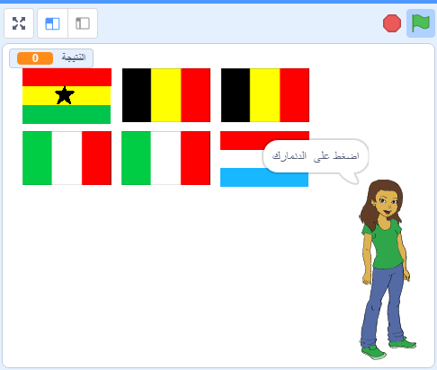

## ما التالي؟

جرب مشروع [تخمين العلم](https://projects.raspberrypi.org/en/projects/guess-the-flag?utm_source=pathway&utm_medium=whatnext&utm_campaign=projects)، حيث يمكنك إنشاء اختبار للعلم لاختبار نفسك وأصدقائك.

\--- no-print \---

انقر على علم الدولة التي يطلب منك.

  <iframe allowtransparency="true" width="485" height="402" src="https://scratch.mit.edu/projects/embed/276891625/?autostart=false" frameborder="0" scrolling="no"></iframe>

\--- /no-print \---

\--- print-only \---

\--- /print-only \---