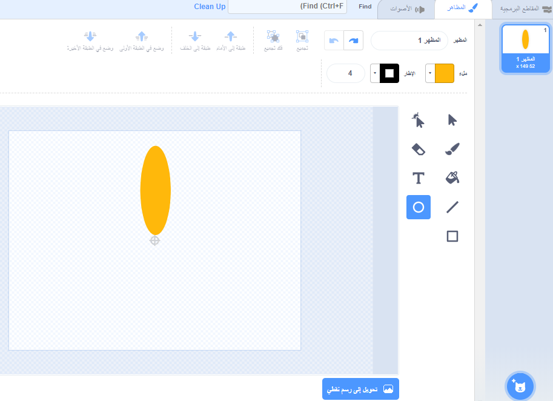
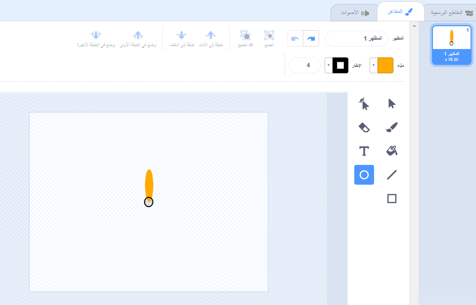

## توليد زهرة

أولا ستقوم بتوليد زهرة يمكن رسمها على المنصة.

\--- task \---

إنشاء مشروع Scratch جديد، وحذف كائن القطة.

[[[generic-scratch3-new-project]]]

\--- /task \---

\--- task \---

أضف ملحق القلم إلى مشروعك.

[[[generic-scratch3-add-pen-extension]]]

\--- /task \---

\--- task \---

الآن استخدم أداة الطلاء لإنشاء كائن جديد يشبه ورق الزهور.

انقر فوق **اختر كائن**، ثم انقر فوق **رسم** وأعد تسمية الكائن 'زهرة'.

[[[generic-scratch3-draw-sprite]]]

\--- /task \---

\--- task \---

استخدم أداة الدائرة لرسم شكل الورقة مليئة باللون البرتقالي.



لاحقًا، سوف تستخدم التعليمات البرمجية لإضافة المزيد من اللون.

\--- /task \---

\--- task \---

أضف التعليمات البرمجية التالية إلى كائن الزهرة إلى `ختم` {: class = "block3extensions"} زهرة بستة اوراق متساوية الاستدارة ` عند النقر على العلم الأخضر ` {: class = "block3control"}.


```blocks3
when green flag clicked
repeat (6) 
  stamp
  turn cw (60) degrees
end
```

\--- /task \---

قد تجد أن اوراقك مرتبة بطريقة غريبة او غير منتظمة:


هذا لأن الكائن يدور حول مركزه.

\--- task \---

حرك اوراقك حتى تصبح اسفلها في المنتصف.



قد يكون القيام بذلك أسهل إذا قمت بالتصغير.

\--- /task \---

قبل أن تقوم بتشغيل التعليمات البرمجية مرة أخرى، يجب أن `مسح الكل`{:class="block3extensions"} الكائنات الموجودة على المنصة.

\--- task \---

انقر فوق التعليمة البرمجية `مسح الكل` في مقطع التعليمة البرمجية للقلم.

```blocks3
erase all
```

\--- /task \---

\--- task \---

قم بتشغيل التعليمات البرمجية الخاصة بك مرة أخرى للتحقق من أن ورق الزهور مستقيمة الآن.


إذا لم يكن الأمر كذلك ، اضبط موضع الورقة حتى قاعها في المنتصف.

\--- /task \---