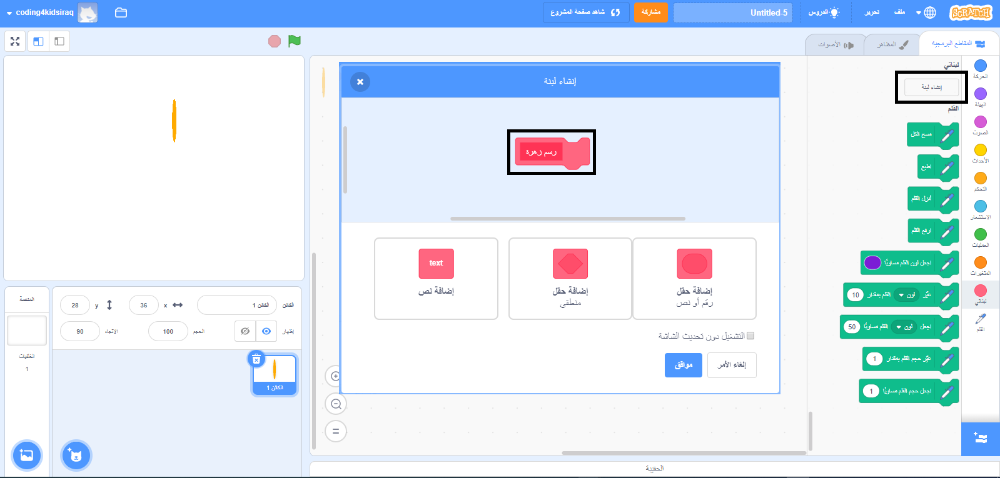

## إنشاء تعليمة برمجية مخصصة لرسم الزهور

ماذا لو كنت تريد رسم الكثير من الزهور؟ بدلاً من عمل الكثير من النسخ من التعليمات البرمجية، ستقوم بإنشاء تعليم برمجية خاصة بك في سكراتش واستخدامها في كل مرة تريد فيها رسم زهرة.

--- task ---

انقر على **الكتل الخاصة بي** ثم على **اصنع تعليمة برمجية** لإنشاء تعليمة برمجية خاصة بك تسمى "رسم زهرة".



--- /task ---

--- task ---

يوجد الآن تعليمة برمجية جديدة تسمى `رسم زهرة`{:class="block3myblocks"} في خانة **المزيد من التعليمات البرمجية** مقطع وتعليمات برمجية جديدة على المسرح.

```blocks3
رسم زهرة :: custom

define رسم زهرة
```

--- /task ---

--- task ---

نقل التعليمات البرمجية الخاصة بك لرسم الزهرة من التعليمة البرمجية `عند النقر فوق العلم الأخضر`{:class="block3events"} الى التعليمة البرمجية الجديدة `رسم زهرة`{:class="block3myblocks"}.

يجب أن تبدو التعليمة البرمجية الخاص بك بالشكل التالي:


```blocks3
define رسم زهرة
repeat (6) 
  stamp
  turn cw (60) degrees
end

when green flag clicked
```

--- /task ---

--- task ---

أضف التعليمة البرمجية التالية لتنظيف شاشة التنفيذ ولاستخدام `رسم زهرة جديدة `{:class="block3myblocks"} عند النقر على العلم الأخضر:


```blocks3
when green flag clicked
erase all
رسم زهرة :: custom
```

--- /task ---

--- task ---

انقر فوق العلم الأخضر لاختبار التعليمة البرمجية الخاصة بك والتحقق مما إذا كنت ترى زهرة.

--- /task ---

--- task ---

الآن قم بتغيير تعليمتك البرمجية لتحريك الكائن ثم ارسم زهرة أخرى:


```blocks3
when green flag clicked
erase all
go to x: (75) y: (75)
رسم زهرة :: custom
go to x: (-75) y: (-75)
رسم زهرة :: custom 
```

--- /task ---

--- task ---

اختبر التعليمة البرمجية للتحقق من أنك ترى الآن زهرتان.


--- /task ---