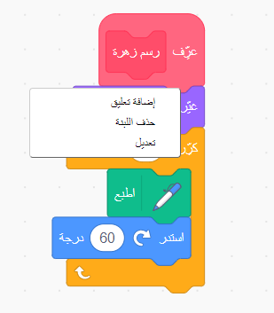
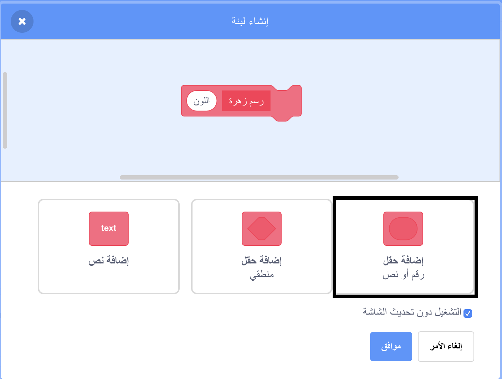
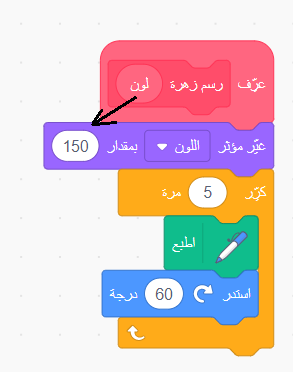

## مظاهر الزهور الخاصة بك

في الوقت الحالي ، كل الأزهار التي ترسمها هي نفسها تمامًا. بعد ذلك ستقوم بإضافة بعض المدخلات إلى `رسم زهرة`{:class="block3myblocks"} تعليمة برمجية بحيث يمكنك رسم الزهور بألوان وأحجام وأعداد مختلفة من الورق.

--- task ---

في Scratch يمكنك استخدام تعليمة `اجعل مؤثر اللون مساويا`{:class="block3looks"} لتغيير لون كائن.

قم بتغيير تعريف 'رسم الزهرة' لتغيير اللون:


```blocks3
define رسم زهرة
set [color v] effect to (150)
repeat (6) 
  stamp
  turn cw (60) degrees
end
```

--- /task ---

--- task ---

قم بتشغيل التعليمات البرمجية الخاصة بك لمشاهدة أزهار بألوان مختلفة.


`اجعل اللون مساويا`{:class="block3looks"} يغير اللون استناداً إلى اللون الافتراضي للكائن، لذلك إذا لم يبدأ الكائن البرتقالي، ستحصل على نتائج مختلفة.

--- /task ---

--- task ---

جرب استخدام أرقام مختلفة من `0` إلى `199` في `التعليمة البرمجية لتعيين تأثير الألوان`{:class="block3looks"}، وشاهد النتائج المختلفة التي تحصل عليها.

--- /task ---

في الوقت الحالي كل الزهور بنفس اللون. لإعطاء كل زهرة لونًا مختلفًا ، تحتاج إلى إضافة **إدخال** إلى `رسم زهرة `{:class="block3myblocks"}.

--- task ---

انقر بزر الماوس الأيمن على التعليمة البرمجية لـ`رسم زهرة`{:class="block3myblocks"} واختر **تعديل**:



--- /task ---

--- task ---

الآن أضف **رقم الإدخال** المسمى 'اللون':



يظهر الإدخال في `رسم زهرة`{:class="block3myblocks"} ، ويمكنك سحبه إلى المكان الذي تريد استخدامه.

--- /task ---

--- task ---

اسحب إدخال "اللون" إلى التعليمة البرمجية `تعيين تأثير اللون`{:class="block3looks"}:



يجب أن تبدو التعليمة البرمجية الخاصة بك بالشكل التالي:


```blocks3
define رسم زهرة (اللون)
set [color v] effect to (اللون :: custom-arg)
repeat (6)
  stamp
  turn cw (60) degrees
end
```

--- /task ---

لاحظ أن التعليمة البرمجية `رسم زهرة`{:class="block3myblocks"} لديها الآن إدخال جديد يتم تعيينه إلى `1`:

```blocks3
when green flag clicked
erase all
go to x: (75) y: (75)
رسم زهرة (1) :: custom
go to x: (-75) y: (-75)
رسم زهرة (1) :: custom
```

--- task ---

قم بتغيير الأرقام في التعليمة البرمجية `رسم زهرة`{:class="block3myblocks"} بحيث يظهر الزهرتان بألوان مختلفة. يمكنك اختيار أي أرقام بين 0 و 200.

يجب أن تبدو التعليمات البرمجية الخاصة بك مشابهة لهذا:


```blocks3
when green flag clicked
erase all
go to x: (75) y: (75)
رسم زهرة (180) :: custom
go to x: (-75) y: (-75)
رسم زهرة (150) :: custom
```

--- /task ---

--- task ---

الآن أضف مدخلاً آخر لتعيين حجم الزهرة، لتبدو التعليمة البرمجية`رسم زهرة`{:class="block3myblocks"} كهذا:


```blocks3
رسم زهرة (180) (150) :: custom
```

مع التعليمة البرمجية أعلاه ، يمكنك إنشاء زهور بأحجام مختلفة:


--- hints ---


--- hint ---

انظر إلى ما فعلته لإضافة `لون` المدخلات، وكرر ذلك لإضافة مدخل 'الحجم' الذي يمكنك استخدامه لتعيين حجم كائن الوردة.

--- /hint ---

--- hint ---

تحرير التعليمة البرمجية`رسم زهرة`{:class="block3myblocks"} لإضافة رقم جديد يسمى "الحجم".

تحتاج إلى إضافة التعليمة البرمجية التالية مع إدخال 'الحجم' إلى التعليمة تعريف `رسم زهرة`{:class="block3myblocks"}:

```blocks3
set size to (100) %
```

--- /hint ---

--- hint ---

انقر بالزر الأيمن على التعليمة تعريف `رسم زهرة`{:class="block3myblocks"}، انقر على **تحرير**، وأضف رقم مدخل يسمى "الحجم".


قم بتغيير النص الخاص بك `تحديد زهرة الرسم`{:class="block3myblocks"} بحيث يبدو كهذا:

```blocks3
define رسم زهرة (اللون) (حجم :: custom-arg)
set [color v] effect to (اللون :: custom-arg)
set size to (حجم :: custom-arg) %
repeat (6) 
  stamp
  turn cw (60) degrees
end
```

--- /hint ---

--- /hints ---

--- /task --- --- task ---

في النص `عند نقر العلم الأخضر`{:class="block3events"} ، قم بتغيير الرقم الثاني في التعليمة البرمجية`رسم زهرة`{:class="block3myblocks"} بحيث يظهر الزهرتان بأحجام مختلفة.

```blocks3
when green flag clicked
erase all
go to x: (75) y: (75)
رسم زهرة (180) (150) :: custom
go to x: (-75) y: (-75)
رسم زهرة (150) (50) :: custom
```

--- /task ---

--- task ---

اختبر تعليماتك البرمجية للتحقق مما إذا كانت الأزهار لها أحجام مختلفة.

--- /task ---

--- task ---

سيكون من الرائع اختيار عددالورق التي تملكها الزهور.

أضف مدخلاً آخر حتى تتمكن من رسم أزهار مثل هذا:


--- hints ---
 --- hint ---

تحتاج إلى إضافة إدخال رقم "الورق" ، ثم استخدامه في التعليمة البرمجية لــ`تحديد رسم زهرة`{:class="block3myblocks"}.

هناك مكانان تحتاج فيهما إلى إضافة مدخلات "الورق".

عدد درجات كائن الزهرة يجب أن `تدور`{:class="block3looks"} بمقدار `360` مقسوماً على عدد الورق.

--- /hint ---

--- hint ---

قم بتغيير النص الخاص بك `تحديد زهرة الرسم`{:class="block3myblocks"} بحيث يبدو كهذا:


```blocks3
define رسم زهرة (اللون) (size :: custom-arg) (petals)
```

قم بتحديث التعليمة البرمجية الخاصة بك `كرر`{:class="block3control"} و `تدور`{:class="block3looks"} حتى يستخدموا مدخلات 'الورق'.

```blocks3
repeat (بتلة :: custom-arg) 
end

turn cw ((360) / (بتلة :: custom-arg)) degrees
```

قم بتحديث التعليمة البرمجية الخاصة بك `رسم الزهرة`{:class="block3myblocks"} لاستخدام مدخلات "الورق".

```blocks3
رسم زهرة (150) (50) (8) :: custom
```

--- /hint ---

--- hint ---

تحرير التعليمة البرمجية`رسم زهرة`{:class="block3myblocks"} لإضافة رقم جديد يسمى "الحجم".


يجب أن تبدو التعليمات البرمجية خاصتك بالشكل التالي:

```blocks3
define رسم زهرة (اللون) (حجم :: custom-arg) (بتلة)
set [color v] effect to (اللون :: custom-arg)
set size to (حجم :: custom-arg) %
repeat (بتلة :: custom-arg) 
  stamp
  turn cw ((360) / (بتلة :: custom-arg)) degrees
end

```

في النص `عند نقر العلم الأخضر`{:class="block3events"} ، قم بتغيير الرقم الثاني في التعليمة البرمجية `رسم زهرة`{:class="block3myblocks"} بحيث يظهر الزهرتان بأحجام مختلفة.

```blocks3
when green flag clicked
erase all
go to x: (75) y: (75)
رسم زهرة (180) (150) (3) :: custom
go to x: (-75) y: (-75)
رسم زهرة (150) (50) (8) :: custom
```

--- /hint ---

--- /hints ---

--- /task ---

بعد ذلك، قم بتعديل التعليمات البرمجية الخاصة بك حتى تتمكن من رسم زهرة مختلفة بالضغط على مفتاح <kbd>f</kbd>.

--- task ---

الآن حرك تعليماتك البرمجية لرسم الزهور بعيدا من أسفل كتلة `عند النقر فوق العلم الأخضر`{:class="block3events"}، ووضع التعليمة البرمجية تحت كتلة `عند الضغط على مفتاح f`{:class="block3events"}.


```blocks3
when green flag clicked
```

```blocks3
when [f v] key pressed
erase all
go to x: (75) y: (75)
رسم زهرة (180) (150) (3) :: custom
go to x: (-75) y: (-75)
رسم زهرة (150) (50) (8) :: custom
```

--- /task ---

--- task ---

اضغط <kbd>f</kbd> لاختبار الكود الخاص بك.

--- /task ---

--- task ---

أضف المزيد من التعليمات البرمجية `رسم زهرة`{:class="block3myblocks"} إلى برنامجك لرسم زهور ذات ألوان وأحجام وأعداد مختلفة من الحيوانات الأليفة في جميع أنحاء المنصة.

--- /task ---