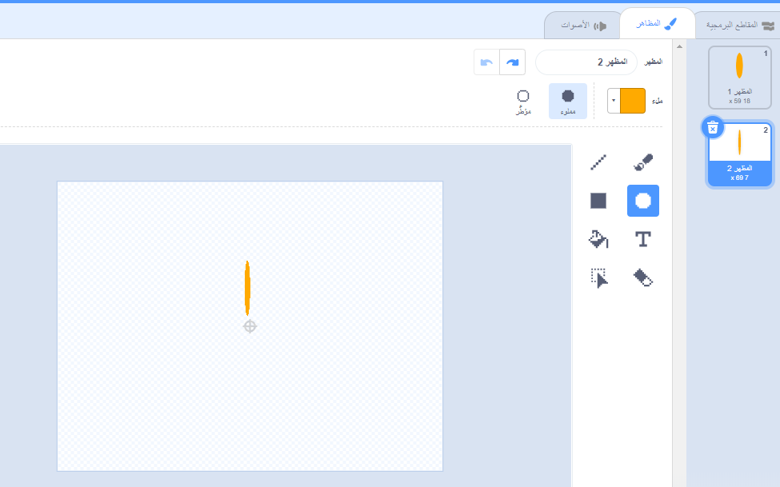

## التحدي: إنشاء تصميم للزهور

هل يمكنك استخدام التعليمة البرمجية لــ`رسم زهرة`{:class="block3myblocks"} عدة مرات لرسم المزيد من الزهور وإنشاء تصميم مثير؟ رسم زهور مختلفة في نفس الموقع يخلق أثرا مثيرا للاهتمام.

قم بإنشاء تصميم يعجبك. إليك مثالًا:

ليس عليك استخدام ورق على شكل قطع ناقصة. على سبيل المثال، يمكنك استخدام خطوط مستقيمة وسوداء لإنشاء نمط الألعاب النارية مثل هذا:

'الورقة' لنمط الألعاب النارية مجرد خط:

أضف مظاهر ورقة جديدة وانظر إلى الزهور التي يمكنك الحصول عليها.

جرب شكل الكائن الذي لا يتم ملؤه، مثل المربع، وانظر ما يحدث

