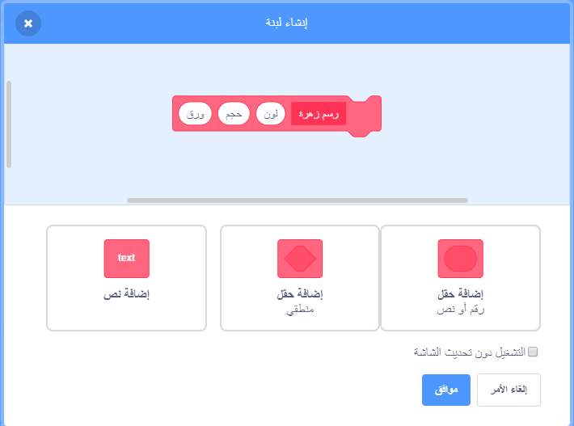
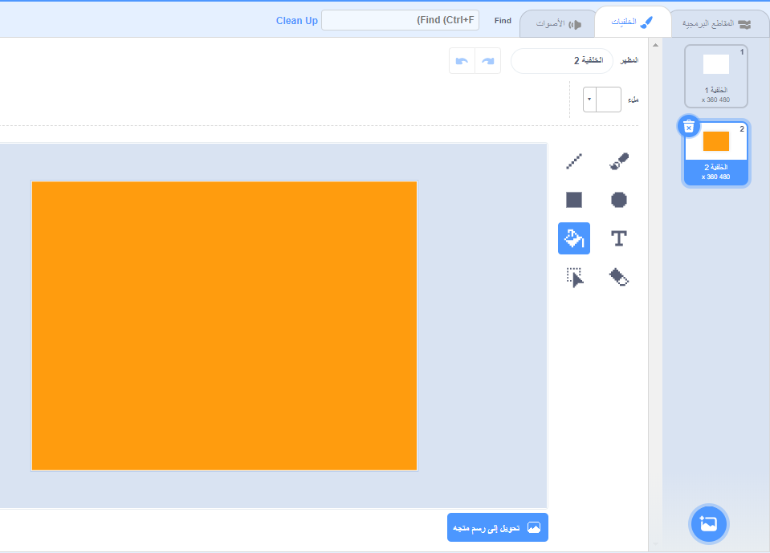

## أنماط الزهور

يمكنك أيضًا استخدام كتلة `رسم زهرة` {: class = "block3myblocks"} لإنشاء أنماط زهور أنيقة.

\--- task \---

إنشاء زهرة أو مزيج من الزهور التي تحب. إليك مثالًا:


```blocks3
when [p v] key pressed
erase all
go to x: (-150) y: (100)
draw flower (150) (80) (7) :: custom
draw flower (130) (35) (20) :: custom
```

\--- /task \---

\--- task \---

اضغط على <kbd> r </kbd> لرؤية زهورك العشوائية. المثال يبدو كالتالي:


\--- /task \---

قبل أن تتمكن من إنشاء نمطك ، يجب عليك مسح الشاشة من أي بقايا زهور.

\--- task \---

انقر فوق التعليمة البرمجية `مسح الكل` في مقطع التعليمة البرمجية للقلم.

```blocks3
مسح الكل
```

\--- /task \---

\--- task \---

انقر بالزر الأيمن على كائن الزهرة و `اختف`{:class="block3looks"} حتى لا يظهر على الشاشة. (يمكنك `عرض `{:class="block3looks"} الكائن مرة أخرى إذا كنت بحاجة إلى رؤية أين هي.)

\--- /task \---

\--- task \---

الآن ارسم صف من هذه الزهور عبر قمة الشاشة. إليك بعض التعليمات البرمجية التي قد تحتاج فيها إلى تعديل الأرقام حتى تعمل مع الزهرة الخاصة بك:


```blocks3
when [p v] key pressed
erase all
go to x: (-150) y: (100)
repeat (4) 
  draw flower (150) (80) (7) :: custom
  draw flower (130) (35) (20) :: custom
  change x by (100)
end
```

\--- /task \---

\--- task \---

اضغط على ` r ` لرؤية زهورك العشوائية:


\--- /task \---

\--- task \---

أضف حلقة تكرار أخرى لإنشاء المزيد من صفوف الزهور. يضيف هذا المثال يضيف حلقة `كرّر ٣`{:class="block3control"} لإنشاء ثلاثة صفوف.


```blocks3
when [p v] key pressed
erase all
go to x: (-150) y: (100)
repeat (3) 
  repeat (4) 
    draw flower (150) (80) (7) :: custom
    draw flower (130) (35) (20) :: custom
    change x by (100)
  end
  set x to (-150)
  change y by (-100)
end
```

\--- /task \---

\--- task \---

اضغط على <kbd> r </kbd> لرؤية زهورك العشوائية:


\--- /task \---

هل تريد تسريع رسم الزهور؟

\--- task \---

انقر بزر الماوس الأيمن على التعليمة البرمجية لـ`رسم زهرة` {: class = "block3myblocks"} واختر ** تعديل**. انقر فوق ** التشغيل دون تحديث شاشة** الصندوق.



الآن يتم رسم الزهور بسرعة أكبر.

\--- /task \---

يمكنك أيضًا تغيير حجم الصورة.

\--- task \---

انقر فوق ** اختيار خلفية** ، ثم انقر فوق ** الرسم**. إنشاء خلفية برتقالية باستخدام أداة التعبئة في وضع الخريطة.



إذا كنت تستخدم اللون البرتقالي للخلفية وكائن الزهرة ، فستطابق الأرقام الخاصة بالألوان المختلفة للكائن والخلفية.

\--- /task \---

\--- task \---

في Scratch يمكنك استخدام تعليمة `اجعل مؤثر اللون مساويا`{:class="block3looks"} لتغيير لون كائن.


```blocks3
when [p v] key pressed
set [color v] effect to (30)
```

\--- /task \---

\--- task \---

حاول إنشاء نمط تحبه.

إليك مثالاً:


\--- /task \---

عندما تضع كل ذلك معًا ، يمكنك إنشاء تأثير مذهل:

