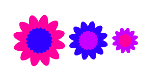

## التحدي: تعليمة الزهور المخصصة

هذه الزهور جميعها لها نفس العدد من الورق الخارجي والداخلي، ويكون حجم الزهرة الداخلية متناسبا مع الزهرة الخارجية:



يمكنك إنشاء زهور مثل هذه بمساعدة `رسم زهرة مزدوجة`{:class="block3myblocks"} قالب مخصص له مدخلات `للون الخارجي`،`اللون الداخلي` و `الحجم`:

```blocks3
define رسم زهرة مزدوجة (لون خارجي) (لون داخلي) (حجم :: custom-arg)
رسم زهرة (لون خارجي :: custom-arg) (حجم :: custom-arg) (12) :: custom
رسم زهرة (لون داخلي :: custom-arg) ((حجم :: custom-arg) / (2)) (20) :: custom
```

التعليمة البرمجية`ارسم زهرة مزدوجة`{:class="block3myblocks"} يمكنها رسم الكثير من الزهور بنفس النمط:

```blocks3
when [d v] key pressed
erase all
go to x: (-100) y: (0)
رسم زهرة مزدوجة (160) (120) (100) :: custom
change x by (100)
رسم زهرة مزدوجة (120) (140) (75) :: custom
change x by (75)
رسم زهرة مزدوجة (140) (160) (50) :: custom
```

إنشاء تعليمة برمجية مخصصة جديدة مع المدخلات الضرورية التي تحتاج إلى أن تكون قادراً على تغييرها لإنشاء نوع من الزهور التي تحب.

ثم استخدم مجموعتك الجديدة لإنشاء تصميم رائع!