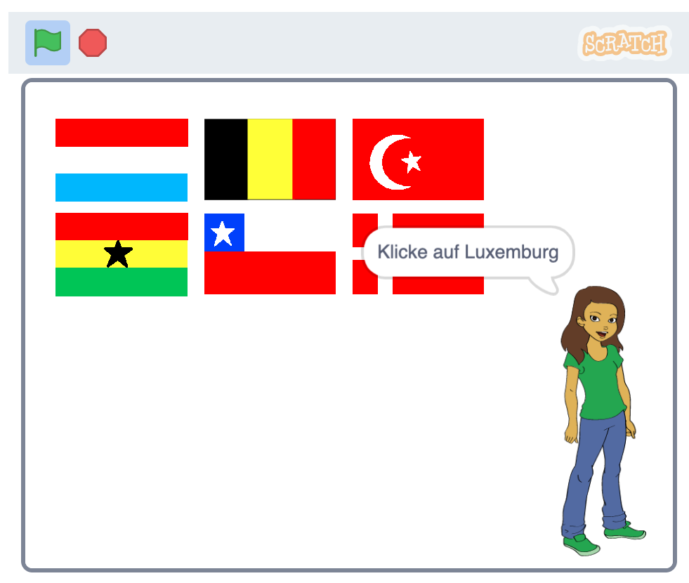

## Was kommt als Nächstes?

Schau dir das [Errate die Flagge](https://projects.raspberrypi.org/de-DE/projects/guess-the-flag?utm_source=pathway&utm_medium=whatnext&utm_campaign=projects) Projekt an, in dem du ein Flaggen-Quiz erstellen kannst, um dich und deine Freunde zu testen.

--- no-print ---

Klicke auf die Flagge des Landes, nach dem du gefragt wirst.

  <iframe allowtransparency="true" width="485" height="402" src="https://scratch.mit.edu/projects/embed/276891625/?autostart=false" frameborder="0" scrolling="no"></iframe>

--- /no-print ---

--- print-only ---

--- /print-only ---

***

Dieses Projekt wurde von freiwilligen Helfern übersetzt:

Lars Reime
Nicole Rotarius

Dank freiwilliger Helfer können wir Menschen auf der ganzen Welt die Möglichkeit geben, in ihrer eigenen Sprache zu lernen. Du kannst uns helfen, mehr Menschen zu erreichen, indem Du dich freiwillig zum Übersetzen meldest - weitere Informationen unter [rpf.io/translate](https://rpf.io/translate).