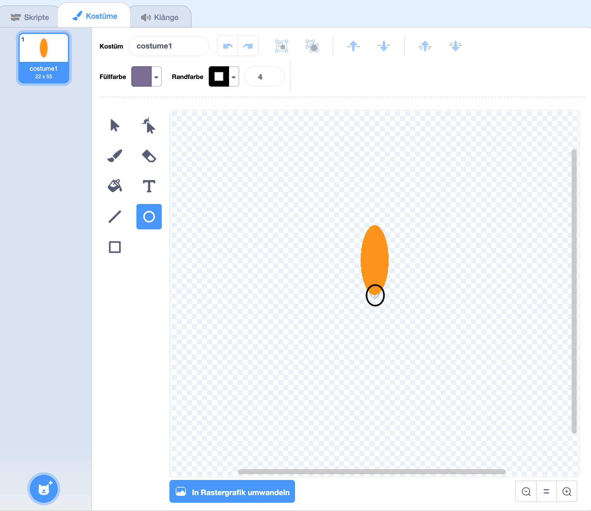

## Erstelle eine Blume

Zuerst wirst du eine Blume erstellen, die auf der Bühne gezeichnet werden kann.

--- task ---

Starte ein neues Scratch-Projekt und lösche die Katzen-Figur.

[[[generic-scratch3-new-project]]]

--- /task ---

--- task ---

Füge die Malstift-Erweiterung zu deinem Projekt hinzu.

[[[generic-scratch3-add-pen-extension]]]

--- /task ---

--- task ---

Verwende nun das Malwerkzeug, um eine neue Figur in Form eines Blütenblattes zu erstellen.

Klicke auf **Figur wählen**, klicke dann auf **Malen** und benenne die Figur in 'Blume' um.

[[[generic-scratch3-draw-sprite]]]

--- /task ---

--- task ---

Verwende das Kreis-Werkzeug, um eine orange gefüllte Blütenblattform zu zeichnen.


Später wirst du Code verwenden, um mehr Farben hinzuzufügen.

--- /task ---

--- task ---

Füge der Blumen-Figur folgenden Code hinzu, um eine Blume mit sechs gleichmäßig angeordneten Blütenblättern `abzudrucken`{:class="block3extensions"}, `wenn auf die grüne Flagge geklickt wird`{:class="block3control"}.


```blocks3
when green flag clicked
repeat (6) 
  stamp
  turn cw (60) degrees
end
```

--- /task ---

Möglicherweise wirst du feststellen, dass deine Blütenblätter komisch angeordnet sind:


Dies liegt daran, dass das Sprite um seine Mitte gedreht wird.

--- task ---

Bewege dein Blütenblatt so, dass sich der untere Teil in der Mitte befindet.



Das ist vielleicht einfacher, wenn du herauszoomst.

--- /task ---

Bevor du deinen Code erneut ausführst, solltest du die Figuren auf der Bühne mit dem `lösche alles`{:class="block3extensions"}-Block entfernen.

--- task ---

Klicke auf den `lösche alles`-Block im Block-Abschnitt Malstift.

```blocks3
erase all
```

--- /task ---

--- task ---

Führe dein Code erneut aus, um zu überprüfen, ob die Blütenblätter gerade sind.


Wenn nicht, passe die Position des Blütenblatts an, bis der untere Teil in der Mitte ist.

--- /task ---