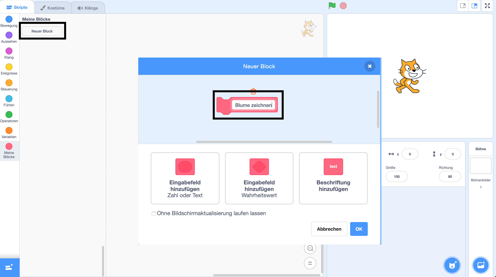

## Erstelle einen eigenen Block, um Blumen zu zeichnen

Was ist, wenn du viele Blumen zeichnen möchtest? Anstatt viele Kopien des Codes zu erstellen, wirst du einen eigenen Block in Scratch erstellen und ihn jedes Mal, wenn du eine Blume zeichnen möchtest, verwenden.

--- task ---

Klicke auf **Meine Blöcke** und dann auf **Neuer Block**, um deinen eigenen Block namens 'Blume zeichnen' zu erstellen.



--- /task ---

--- task ---

Es gibt jetzt einen neuen Block namens `Blume zeichnen`{:class="block3myblocks"} im **Mehr-Blöcke**-Abschnitt und einen neuen Definitionsblock auf der Bühne.

```blocks3
draw flower :: custom

define draw flower
```

--- /task ---

--- task ---

Verschiebe deinen Code zum Zeichnen der Blume von `Wenn die grüne Flagge angeklickt wird`{:class="block3events"} zu dem neuen `Blume zeichnen`{:class="block3myblocks"}-Definitionsblock.

Dein Code sollte so aussehen:


```blocks3
define draw flower
repeat (6) 
  stamp
  turn cw (60) degrees
end

when green flag clicked
```

--- /task ---

--- task ---

Füge folgenden Code hinzu, um die Bühne zu löschen und deinen neuen `Blume zeichnen`{:class="block3myblocks"}-Block zu verwenden, wenn die grüne Flagge angeklickt wird:


```blocks3
when green flag clicked
erase all
draw flower :: custom
```

--- /task ---

--- task ---

Klicke auf die grüne Flagge, um deinen Code zu testen und zu überprüfen, ob du eine Blume siehst.

--- /task ---

--- task ---

Ändere nun deinen Code, um die Figur zu verschieben, und zeichne dann eine weitere Blume:


```blocks3
when green flag clicked
erase all
go to x: (75) y: (75)
draw flower :: custom
go to x: (-75) y: (-75)
draw flower :: custom 
```

--- /task ---

--- task ---

Teste deinen Code, um sicherzustellen, dass du jetzt zwei Blumen siehst.


--- /task ---