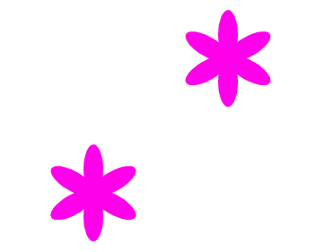

## Personalisiere deine Blumen

Im Moment sind alle Blumen, die du zeichnest, genau gleich. Als Nächstes fügst du dem Block `Blume zeichnen`{:class="block3myblocks"} einige Eingaben hinzu, damit du Blumen mit unterschiedlichen Farben, Größen und Anzahl der Blütenblätter zeichnen kannst.

\--- task \---

In Scratch kannst du den `Setze Effekt Farbe auf`{:class="block3looks"}-Block verwenden, um die Farbe der Figur zu ändern.

Ändere deine 'Blume zeichnen' Definition, um die Farbe zu ändern:


```blocks3
define draw flower
set [color v] effect to (150)
repeat (6) 
  stamp
  turn cw (60) degrees
end
```

\--- /task \---

\--- task \---

Führe deinen Code aus, um Blumen in verschiedenen Farben zu sehen.



Der `Setze Effekt Farbe auf`{:class="block3looks"}-Block ändert die Farbe basierend auf der Standardfarbe der Figur. Wenn also deine Figur nicht orange ist, wirst du unterschiedliche Ergebnisse erhalten.

\--- /task \---

\--- task \---

Experimentiere mit der Verwendung unterschiedlicher Zahlen von `0` bis `199` in dem `Setze Effekt Farbe auf`{:class="block3looks"}-Block und sieh, welche unterschiedlichen Ergebnisse du erhältst.

\--- /task \---

Im Moment haben alle Blumen die gleiche Farbe. Um jeder Blume eine andere Farbe zuzuweisen, musst du dem `Blume zeichnen`{:class="block3myblocks"}-Block eine **Eingabe** hinzufügen.

\--- task \---

Mache einen Rechtsklick auf den `Blume zeichnen`{:class="block3myblocks"}-Definitionsblock und wähle **Bearbeiten**:


\--- /task \---

\--- task \---

Wähle nun **Eingabefeld hinzufügen** und nenne es 'Farbe':


Die Eingabe wird in der Definition von `Blume zeichnen`{:class="block3myblocks"} angezeigt und du kannst sie an die von dir gewünschte Stelle ziehen.

\--- /task \---

\--- task \---

Ziehe die 'Farbe'-Eingabe in den `Setze Effekte Farbe auf`{:class="block3looks"}-Block:


Dein Code sollte so aussehen:


```blocks3
define draw flower (colour)
set [color v] effect to (colour :: custom-arg)
repeat (6)
  stamp
  turn cw (60) degrees
end
```

\--- /task \---

Beachte, dass deine `Blume zeichnen`{:class="block3myblocks"}-Blöcke jetzt eine neue Eingabe haben, die auf `1` gesetzt ist:

```blocks3
when green flag clicked
erase all
go to x: (75) y: (75)
draw flower (1) :: custom
go to x: (-75) y: (-75)
draw flower (1) :: custom
```

\--- task \---

Ändere die Zahlen in den `Blume zeichnen`{:class="block3myblocks"}-Blöcken, so dass die beiden Blumen in unterschiedlichen Farben angezeigt werden. Du kannst jede beliebige Zahl zwischen 0 und 200 auswählen.

Dein Code sollte ungefähr so aussehen:


```blocks3
when green flag clicked
erase all
go to x: (75) y: (75)
draw flower (180) :: custom
go to x: (-75) y: (-75)
draw flower (150) :: custom
```

\--- /task \---

\--- task \---

Füge nun eine weitere Eingabe hinzu, um die Größe der Blume festzulegen, sodass dein `Blume zeichnen`{:class="block3myblocks"}-Block wie folgt aussieht:


```blocks3
draw flower (180) (150) :: custom
```

Mit dem obigen Block kannst du Blumen in verschiedenen Größen erstellen:


\--- hints \---

\--- hint \---

Schaue dir an, was du getan hast, um die `Farbe`-Eingabe hinzuzufügen und wiederhole das, um die 'Größe'-Eingabe hinzuzufügen, mit der du die Größe der Blumen-Figur einstellen kannst.

\--- /hint \---

\--- hint \---

Bearbeite den `Blume zeichnen`{:class="block3myblocks"}-Block, um eine neuen Zahleneingabe namens 'Größe' hinzuzufügen.

Du musst den folgenden Block mit einer 'Größe'-Eingabe zum `Blume zeichnen`{:class="block3myblocks"}-Definitionsblock hinzufügen:

```blocks3
set size to (100) %
```

\--- /hint \---

\--- hint \---

Mache einen Rechtsklick auf den `Blume zeichnen`{:class="block3myblocks"}-Definitionsblock und klicke auf **Bearbeiten**. Füge dann eine Zahleneingabe namens 'Größe' hinzu.


Ändere dein `Definiere Blume zeichnen`{:class="block3myblocks"}-Skript, damit es so aussieht:

```blocks3
define draw flower (colour) (size :: custom-arg)
set [color v] effect to (colour :: custom-arg)
set size to (size :: custom-arg) %
repeat (6) 
  stamp
  turn cw (60) degrees
end
```

\--- /hint \---

\---/hints\---

\--- /task \--- \--- task \---

Ändere in dem `Wenn grüne Flagge angeklickt wird`{:class="block3events"}-Skript die zweite Zahl von beiden `Blume zeichnen`{:class="block3myblocks"}-Blöcken, sodass die beiden angezeigten Blumen eine unterschiedliche Größe haben.

```blocks3
when green flag clicked
erase all
go to x: (75) y: (75)
draw flower (180) (150) :: custom
go to x: (-75) y: (-75)
draw flower (150) (50) :: custom
```

\--- /task \---

\--- task \---

Teste deinen Code, um zu prüfen, ob die Blumen unterschiedliche Größe haben.

\--- /task \---

\--- task \---

Es wäre cool, die Anzahl der Blütenblätter der Blumen zu wählen.

Füge eine weitere Eingabe hinzu, um Blumen wie folgt zeichnen zu können:


\--- hints \--- \--- hint \---

Du musst eine 'Blätter'-Zahleneingabe hinzufügen und sie dann im `Definiere Blume zeichnen`{:class="block3myblocks"}-Block verwenden zu können.

Es gibt zwei Stellen, an denen du die Eingabe 'Blätter' hinzufügen musst.

Die Gradanzahl, um die die Blumen-Figur `sich drehen`{:class="block3looks"} soll, ist `360` geteilt durch die Anzahl der Blütenblätter.

\---/hint\---

\--- hint \---

Ändere deinen `Definiere Blume zeichnen`{:class="block3myblocks"}-Block, damit er so aussieht:


```blocks3
define draw flower (colour) (size :: custom-arg) (petals)
```

Aktualisiere deine `wiederhole`{:class="block3control"} und `sich drehen`{:class="block3looks"} Blöcke, so dass sie die 'Blätter'-Eingabe verwenden.

```blocks3
repeat (petals :: custom-arg) 
end

turn cw ((360) / (petals :: custom-arg)) degrees
```

Aktualisiere deine `Blume zeichnen`{:class="block3myblocks"}-Blöcke, um die 'Blätter'-Eingabe zu nutzen.

```blocks3
draw flower (150) (50) (8) :: custom
```

\--- /hint \---

\--- hint \---

Bearbeite deinen `Definiere Blume zeichnen`{:class="block3myblocks"}-Block und füge eine neue Zahleneingabe namens 'Blütenblätter' hinzu.


Dein Code sollte so aussehen:

```blocks3
define draw flower (colour) (size :: custom-arg) (petals)
set [color v] effect to (colour :: custom-arg)
set size to (size :: custom-arg) %
repeat (petals :: custom-arg) 
  stamp
  turn cw ((360) / (petals :: custom-arg)) degrees
end

```

Ändere in dem `Wenn grüne Flagge angeklickt wird`{:class="block3events"}-Skript die dritte Zahl von beiden `Blume zeichnen`{:class="block3myblocks"}-Blöcken, sodass die beiden angezeigten Blumen eine unterschiedliche Anzahl an Blütenblättern haben.

```blocks3
when green flag clicked
erase all
go to x: (75) y: (75)
draw flower (180) (150) (3) :: custom
go to x: (-75) y: (-75)
draw flower (150) (50) (8) :: custom
```

\--- /hint \---

\--- /hints \---

\--- /task \---

Bearbeite anschließend deinen Code, damit due verschiedene Blumen zeichnen kannst, wenn du die Taste <kbd>f</kbd> drückst.

\--- task \---

Bewege nun deinen Code zum Zeichnen von Blumen weg vom `Wenn grüne Flagge angeklickt wird`{:class="block3events"}-Block und setze ihn unter den `Wenn Taste f gedrückt wird`{:class="block3events"}-Block.


```blocks3
when green flag clicked
```

```blocks3
when [f v] key pressed
erase all
go to x: (75) y: (75)
draw flower (180) (150) (3) :: custom
go to x: (-75) y: (-75)
draw flower (150) (50) (8) :: custom
```

\--- /task \---

\--- task \---

Drücke <kbd>f</kbd>, um deinen Code zu testen.

\--- /task \---

\--- task \---

Füge weitere `Blume zeichnen`{:class="block3myblocks"}-Blöcke zu deinem Programm hinzu, um Blumen mit unterschiedlichen Farben, Größen und Anzahl an Blütenblättern auf deiner Bühne zu zeichnen.

\--- /task \---