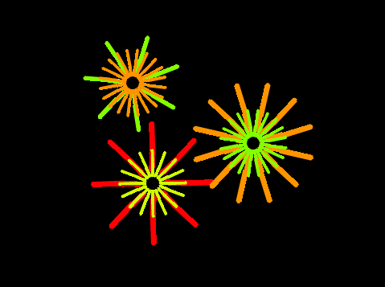
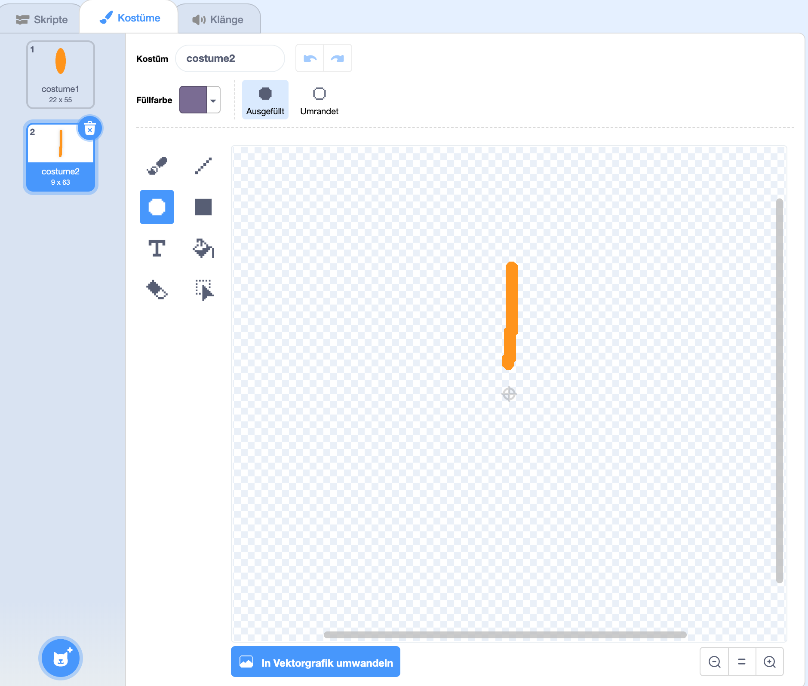

## Herausforderung: Erstelle ein Blumendesign

Kannst du deinen `Blume zeichnen`{:class="block3myblocks"}-Block mehrmals verwenden, um mehr Blumen zu zeichnen und ein interessantes Design zu erstellen? Das Zeichnen verschiedener Blumen am gleichen Ort sorgt für einen interessanten Effekt.

Erstelle eine Design, das dir gefällt. Hier ist ein Beispiel:

Du musst keine Blütenblätter verwenden, die eine Form wie Ellipsen haben. Zum Beispiel kannst du dicke gerade Linien und eine schwarze Kulisse verwenden, um ein Feuerwerksmuster wie folgt zu erstellen:

Das 'Blütenblatt' für das Feuerwerksmuster ist nur eine Linie:

Füge ein neues Blütenblatt-Kostüm hinzu und sieh, welche Blumen du damit erstellen kannst.

Probiere eine Figur-Form aus, die nicht ausgefüllt ist, beispielsweise ein Quadrat, und schau, was passiert

