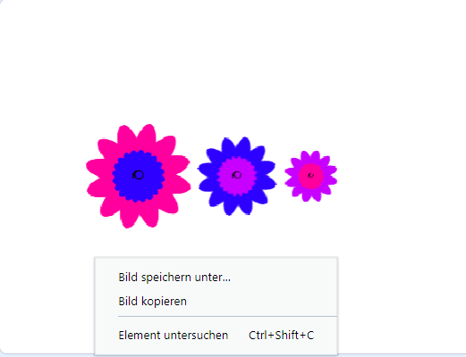

## Speichere deine Bilder

Wenn du ein Bild erstellst, das dir gefällt, kannst du es speichern und in einem anderen Scratch-Projekt als Bildschirmschoner oder auf einer Website verwenden.

--- task ---

Wenn es ein Bild auf der Bühne gibt, das dir gefällt, dann klicke mit der rechten Maustaste und dann klicke auf **Bild speichern unter**

**Hinweis:** Auf einigen Computern oder Browsern kann die Menüoption zum Speichern deines Bildes anders benannt sein.

Dann kannst du ein PNG-Bild der Bühne speichern.

--- /task ---