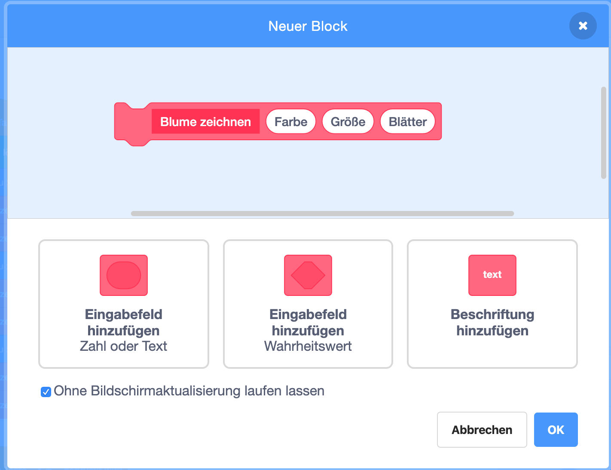
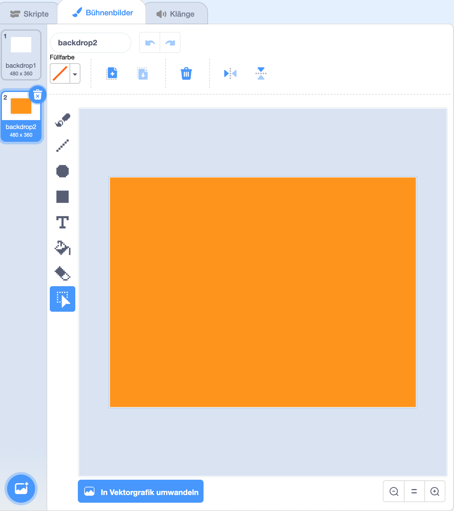

## Blumenmuster

Du kannst auch deinen `Blume zeichnen`{:class="block3myblocks"}-Block, um feine Blumenmuster zu erstellen.

--- task ---

Erstelle eine Blume oder eine Kombination von Blumen, die dir gefällt. Hier ist ein Beispiel:


```blocks3
when [p v] key pressed
erase all
go to x: (-150) y: (100)
draw flower (150) (80) (7) :: custom
draw flower (130) (35) (20) :: custom
```

--- /task ---

--- task ---

Drücke <kbd>p</kbd>, um deine Blume zu sehen. Das Beispiel sieht folgendermaßen aus:


--- /task ---

Bevor du dein eigenes Muster erstellen kannst, solltest du alle verbliebenen Blumen von der Bühne löschen.

--- task ---

Klicke auf den `lösche alles`-Block im Malstift-Reiter.

```blocks3
alle löschen
```

--- /task ---

--- task ---

Klicke mit der rechten Maustaste auf die Blumen-Figur und `verstecke`{:class="block3looks"} sie, damit sie nicht auf der Bühne angezeigt wird. (Du kannst die Figur wieder `sichtbar`{:class="block3looks"} machen, wenn du sehen musst, wo sie sich befindet.)

--- /task ---

--- task ---

Zeichne nun eine Reihe dieser Blumen am oberen Rand der Bühne. Hier ist ein Beispiel-Code, in dem du eventuell die Zahlen anpassen musst, damit sie mit deiner Blume funktionieren:


```blocks3
when [p v] key pressed
erase all
go to x: (-150) y: (100)
repeat (4) 
  draw flower (150) (80) (7) :: custom
  draw flower (130) (35) (20) :: custom
  change x by (100)
end
```

--- /task ---

--- task ---

Drücke `p`, um eine Reihe von Blumen zu sehen:


--- /task ---

--- task ---

Füge eine weitere Schleife hinzu, um weitere Blumenreihen zu erzeugen. Dieses Beispiel fügt eine `Wiederhole 3 mal`{:class="block3control"}-Schleife hinzu, um drei Reihen zu erstellen.


```blocks3
when [p v] key pressed
erase all
go to x: (-150) y: (100)
repeat (3) 
  repeat (4) 
    draw flower (150) (80) (7) :: custom
    draw flower (130) (35) (20) :: custom
    change x by (100)
  end
  set x to (-150)
  change y by (-100)
end
```

--- /task ---

--- task ---

Drücke <kbd>p</kbd>, um ein Blumenraster zu erstellen:


--- /task ---

Möchtest du das Zeichnen der Blumen beschleunigen?

--- task ---

Mache einen Rechtsklick auf den `Blume zeichnen`{:class="block3myblocks"}-Definitionsblock und klicke dann auf **Bearbeiten**. Klicke die **Ohne Bildschirmaktualisierung laufen lassen**-Box an.



Jetzt werden die Blumen schneller gezeichnet.

--- /task ---

Du kannst auch die Farbe der Bühne ändern.

--- task ---

Klicke auf **Bühnenbild wählen** und dann auf **Malen**. Erstelle ein orangefarbenes Bühnenbild, indem du das Füllwerkzeug im Raster-Modus verwendest.



Wenn du Orange für das Bühnenbild und die Blumen-Figur verwendest, stimmen die Zahlen für verschiedene Farben für die Figur und das Bühnenbild überein.

--- /task ---

--- task ---

Jetzt kannst du den `Setze Farbeffekt auf`{:class="block3looks"}-Block auf der Bühne verwenden, um die Farbe des Bühnenbildes zu ändern.


```blocks3
when [p v] key pressed
set [color v] effect to (30)
```

--- /task ---

--- task ---

Versuche, ein Muster zu erstellen, das dir gefällt.

Hier ist ein Beispiel:


--- /task ---

Wenn du alles zusammenstellst, kannst du einen erstaunlichen Effekt erzielen:

