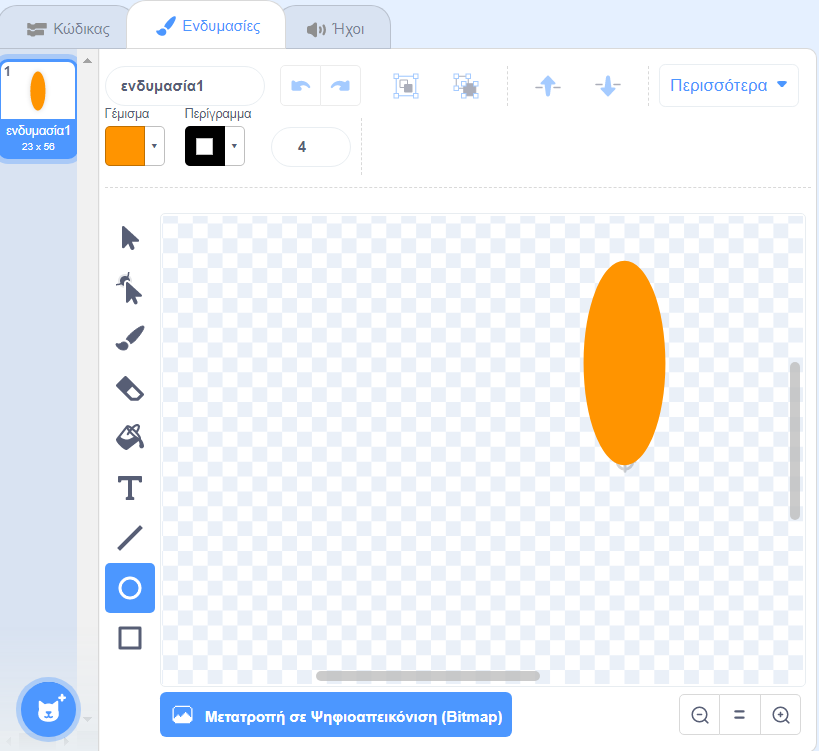
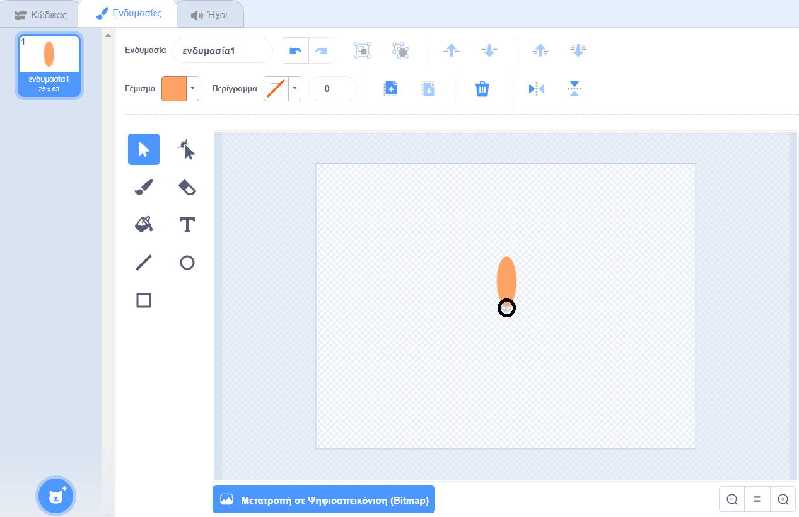

## Δημιούργησε ένα λουλούδι

Πρώτα θα δημιουργήσεις ένα λουλούδι που μπορεί να σχεδιαστεί πάνω στη Σκηνή.

\--- task --

Ξεκίνησε ένα νέο έργο Scratch και διάγραψε τον χαρακτήρα της γάτας.

[[[generic-scratch3-new-project]]]

\--- /task \---

\--- task --

Πρόσθεσε την επέκταση πένας στο έργο σου.

[[[generic-scratch3-add-pen-extension]]]

\--- /task \---

\--- task --

Τώρα χρησιμοποίησε το εργαλείο Ζωγραφική για να δημιουργήσεις ένα νέο αντικείμενο με το σχήμα ενός πέταλου λουλουδιού.

Κάνε κλικ στο **Επιλέξτε ένα Αντικείμενο** και μετά κάνε κλικ στο **Ζωγραφική** και μετονόμασε το αντικείμενο σε «λουλούδι».

[[[generic-scratch3-draw-sprite]]]

\--- /task \---

\--- task --

Χρησιμοποίησε το εργαλείο Κύκλος για να σχεδιάσεις ένα πέταλο γεμισμένο με πορτοκαλί χρώμα.



Αργότερα, θα χρησιμοποιήσεις κώδικα για να προσθέσεις περισσότερα χρώματα.

\--- /task \---

\--- task --

Πρόσθεσε τον ακόλουθο κώδικα στο αντικείμενο "λουλούδι" για να βάλεις μια `σφραγίδα`{:class="block3extensions"} ενός λουλουδιού με έξι εξίσου περιστρεφόμενα πέταλα ` όταν γίνει κλικ σε πράσινη σημαία`{:class="block3control"}.


```blocks3
when green flag clicked
repeat (6) 
  stamp
  turn cw (60) degrees
end
```

\--- /task \---

Μπορεί να διαπιστώσεις ότι τα πέταλα είναι διατεταγμένα με περίεργο τρόπο:


Αυτό συμβαίνει επειδή το αντικείμενο περιστρέφεται γύρω από το κέντρο του.

\--- task --

Μετακίνησε το πέταλό σου έτσι ώστε το κάτω μέρος του να βρίσκεται στο κέντρο.



Κάτι τέτοιο μπορεί να είναι ευκολότερο εάν κάνεις σμίκρυνση (zoom out).

\--- /task \---

Προτού εκτελέσεις ξανά τον κώδικά σου, `καθάρισε όλα`{:class="block3extensions"} τα αντικείμενα από τη Σκηνή.

\--- task --

Κάνε κλικ στην εντολή `καθάρισε όλα` στο μενού Πένα.

```blocks3
erase all
```

\--- /task \---

\--- task --

Εκτέλεσε ξανά τον κώδικα για να ελέγξεις ότι τα πέταλα του λουλουδιού είναι ίσια τώρα.


Εάν όχι, προσάρμοσε τη θέση του πέταλου μέχρι το κάτω μέρος του να είναι στο κέντρο.

\--- /task \---