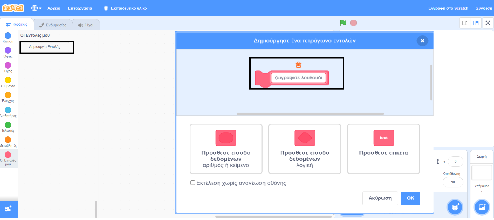

## Φτιάξε μια εντολή που σχεδιάζει λουλούδια

Τι γίνεται αν θέλεις να σχεδιάσεις πολλά λουλούδια; Αντί να δημιουργείς πολλά αντίγραφα του κώδικα, θα δημιουργήσεις το δικό σου μπλοκ στο Scratch και θα το χρησιμοποιείς κάθε φορά που θέλεις να σχεδιάσεις ένα λουλούδι.

--- task ---

Κάνε κλικ στο μενού **Οι Εντολές μου** και μετά στη **Δημιουργία εντολής** για να δημιουργήσεις το δικό σου μπλοκ που θα ονομάζεται «ζωγράφισε λουλούδι».



--- /task ---

--- task ---

Υπάρχει τώρα ένα νέο μπλοκ που ονομάζεται `ζωγράφισε λουλούδι`{:class="block3myblocks"} στις **Εντολές μου** και ένα νέο μπλοκ ορισμού στη Σκηνή.

```blocks3
ζωγράφισε λουλούδι :: custom

define ζωγράφισε λουλούδι
```

--- /task ---

--- task ---

Μετακίνησε τον κώδικά σου για τη δημιουργία του λουλουδιού από το μπλοκ `όταν γίνει κλικ σε πράσινη σημαία`{:class="block3events"} στον ορισμό της νέας εντολής `ζωγράφισε λουλούδι`{:class="block3myblocks"}.

Ο κώδικας θα πρέπει να μοιάζει κάπως έτσι:


```blocks3
define ζωγράφισε λουλούδι
repeat (6) 
  stamp
  turn cw (60) degrees
end

when green flag clicked
```

--- /task ---

--- task ---

Πρόσθεσε τον ακόλουθο κώδικα για να καθαρίσεις τη Σκηνή και να χρησιμοποιήσεις το νέο σου μπλοκ `ζωγράφισε λουλούδι`{:class="block3myblocks"} όταν κάνεις κλικ στην πράσινη σημαία:


```blocks3
when green flag clicked
erase all
ζωγράφισε λουλούδι :: custom
```

--- /task ---

--- task ---

Κάνε κλικ στην πράσινη σημαία για να ελέγξεις τον κώδικά σου και έλεγξε αν πράγματι σχηματίζεται ένα λουλούδι.

--- /task ---

--- task ---

Τώρα άλλαξε τον κώδικα για να μετακινήσεις το αντικείμενο και στη συνέχεια να σχεδιάσεις ένα άλλο λουλούδι:


```blocks3
when green flag clicked
erase all
go to x: (75) y: (75)
ζωγράφισε λουλούδι :: custom
go to x: (-75) y: (-75)
ζωγράφισε λουλούδι :: custom 
```

--- /task ---

--- task ---

Δοκίμασε τον κώδικά σου για να βεβαιωθείς ότι τώρα βλέπεις δύο λουλούδια.


--- /task ---