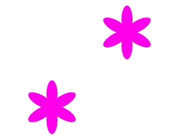
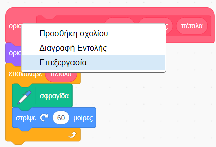
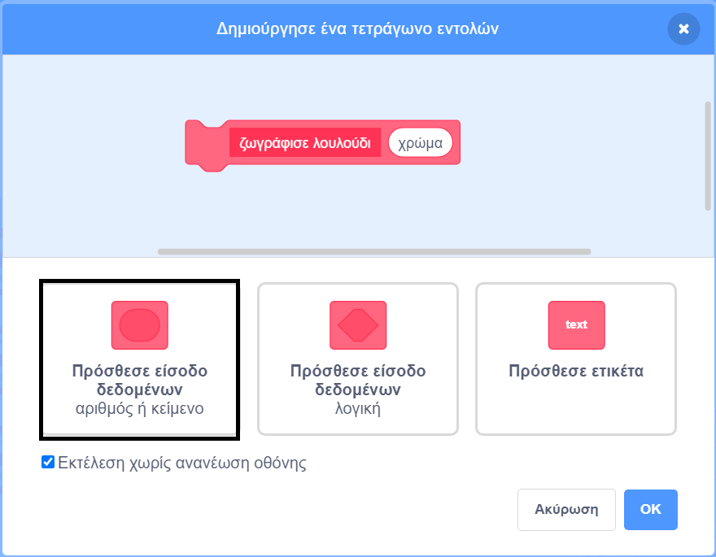
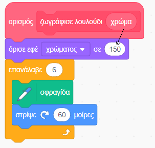

## Φτιάξε τα δικά σου λουλούδια

Προς το παρόν όλα τα λουλούδια που σχεδιάζεις είναι ακριβώς τα ίδια. Στη συνέχεια πρόκειται να προσθέσεις μερικές παραμέτρους εισόδου στο μπλοκ `ζωγράφισε λουλούδι`{:class="block3myblocks"} ώστε να μπορείς να σχεδιάζεις λουλούδια με διαφορετικά χρώματα, μεγέθη και αριθμό πετάλων.

\--- task \---

Στο Scratch μπορείς να χρησιμοποιήσεις το μπλοκ `όρισε εφέ χρώματος`{:class = "block3looks"} για να αλλάξεις το χρώμα ενός αντικειμένου.

Άλλαξε τον ορισμό της εντολής «ζωγράφισε λουλούδι» για να αλλάζεις το χρώμα:


```blocks3
define draw flower
set [color v] effect to (150)
repeat (6) 
  stamp
  turn cw (60) degrees
end
```

\--- /task \---

\--- task \---

Εκτέλεσε τον κώδικα για να δεις λουλούδια διαφορετικών χρωμάτων.



Η εντολή `όρισε εφέ χρώματος`{:class="block3looks"} αλλάζει το χρώμα με βάση το προεπιλεγμένο χρώμα του αντικειμένου, οπότε αν το αντικείμενό σου δεν ξεκινά με πορτοκαλί χρώμα, θα έχεις διαφορετικά αποτελέσματα.

\--- /task \---

\--- task \---

Πειραματίσου με τη χρήση διαφορετικών αριθμών από `0` έως `199` στο μπλοκ `όρισε εφέ χρώματος`{:class="block3looks"} και δες τι αποτελέσματα προκύπτουν.

\--- /task \---

Προς το παρόν όλα τα λουλούδια έχουν το ίδιο χρώμα. Για να δώσεις σε κάθε λουλούδι ένα διαφορετικό χρώμα, πρέπει να προσθέσεις μια παράμετρο **εισόδου** στο μπλοκ `ζωγράφισε λουλούδι`{:class="block3yblocks"}.

\--- task \---

Κάνε δεξί κλικ στο `ορισμός ζωγράφισε λουλούδι`{:class="block3myblocks"} και επίλεξε **Επεξεργασία**:



\--- /task \---

\--- task \---

Τώρα πρόσθεσε μια **είσοδο δεδομένων** που ονομάζεται «χρώμα»:



Η παράμετρος εισόδου θα εμφανιστεί στον ορισμό του μπλοκ `ζωγράφισε λουλούδι`{:class="block3myblocks"} και μπορείς να τη σύρεις σε όποιο σημείο του προγράμματος θέλεις να το χρησιμοποιήσεις.

\--- /task \---

\--- task \---

Βάλε την παράμετρο 'χρώμα' στο μπλοκ `όρισε εφέ χρώματος`{:class="block3looks"}:



Ο κώδικας θα πρέπει να μοιάζει κάπως έτσι:


```blocks3
define draw flower (colour)
set [color v] effect to (colour :: custom-arg)
repeat (6)
  stamp
  turn cw (60) degrees
end
```

\--- /task \---

Παρατήρησε ότι το μπλοκ `ζωγράφισε λουλούδι`{:class="block3myblocks"} παίρνει τώρα μια νέα είσοδο που έχει οριστεί σε `1`:

```blocks3
when green flag clicked
erase all
go to x: (75) y: (75)
draw flower (1) :: custom
go to x: (-75) y: (-75)
draw flower (1) :: custom
```

\--- task \---

Άλλαξε τους αριθμούς στο μπλοκ `ζωγράφισε λουλούδι`{:class="block3myblocks"}, έτσι ώστε τα δύο λουλούδια να εμφανίζονται με διαφορετικά χρώματα. Μπορείς να επιλέξεις αριθμούς μεταξύ του 0 και του 200.

Ο κώδικας θα πρέπει να μοιάζει κάπως έτσι:


```blocks3
when green flag clicked
erase all
go to x: (75) y: (75)
draw flower (180) :: custom
go to x: (-75) y: (-75)
draw flower (150) :: custom
```

\--- /task \---

\--- task \---

Τώρα πρόσθεσε μια επιπλέον παράμετρο εισόδου για να ορίζεις το μέγεθος του λουλουδιού, έτσι ώστε το μπλοκ `ζωγράφισε λουλούδι`{:class="block3myblocks"} να μοιάζει έτσι:


```blocks3
draw flower (180) (150) :: custom
```

Με το παραπάνω μπλοκ, μπορείς να δημιουργείς λουλούδια με διαφορετικά μεγέθη:


\--- hints \---

\--- hint \---

Δες τι έκανες πριν για να προσθέσεις την είσοδο `χρώμα` και προσπάθησε να το επαναλάβεις για να προσθέσεις τη νέα είσοδο «μέγεθος» που θα καθορίζει το μέγεθος του λουλουδιού.

\--- /hint \---

\--- hint \---

Μπορείς να επεξεργαστείς το μπλοκ `ζωγράφισε λουλούδι`{:class="block3myblocks"} για να προσθέσεις μια νέα αριθμητική είσοδο που θα ονομάζεται 'μέγεθος'.

Πρέπει να προσθέσεις το ακόλουθο μπλοκ με μια είσοδο «μέγεθος» στο μπλοκ `ορισμός ζωγράφισε λουλούδι`{:class="block3myblocks"}:

```blocks3
set size to (100) %
```

\--- /hint \---

\--- hint \---

Κάνε δεξί κλικ στον ορισμό του μπλοκ `ζωγράφισε λουλούδι`{:class="block3myblocks"}, επίλεξε το **Επεξεργασία ** και πρόσθεσε μια νέα είσοδο δεδομένων που ονομάζεται «μέγεθος».


Άλλαξε τον κώδικα στο `ορισμός ζωγράφισε λουλούδι`{:class="block3myblocks"}, έτσι ώστε να μοιάζει με αυτό:

```blocks3
define draw flower (colour) (size :: custom-arg)
set [color v] effect to (colour :: custom-arg)
set size to (size :: custom-arg) %
repeat (6) 
  stamp
  turn cw (60) degrees
end
```

\--- /hint \---

\--- /hints \---

\--- /task \--- \--- task \---

Στις εντολές του `όταν γίνει κλικ σε πράσινη σημαία`{:class="block3events"}, άλλαξε τον δεύτερο αριθμό και στα δύο μπλοκ `ζωγράφισε λουλούδι`{:class="block3myblocks"}, έτσι ώστε τα δύο λουλούδια να εμφανίζονται με διαφορετικά μεγέθη.

```blocks3
when green flag clicked
erase all
go to x: (75) y: (75)
draw flower (180) (150) :: custom
go to x: (-75) y: (-75)
draw flower (150) (50) :: custom
```

\--- /task \---

\--- task \---

Δοκίμασε τον κώδικα για να ελέγξεις αν όντως τα λουλούδια έχουν διαφορετικά μεγέθη.

\--- /task \---

\--- task \---

Θα ήταν ωραίο να μπορείς να επιλέγεις και τον αριθμό των πετάλων που έχουν τα λουλούδια.

Πρόσθεσε μια επιπλέον είσοδο για να σχεδιάζεις τα λουλούδια όπως αυτό:


\--- hints \--- \--- hint \---

Πρέπει να προσθέσεις μια επιπλέον αριθμητική παράμετρο εισόδου «πέταλα» και, στη συνέχεια, να τη χρησιμοποιείς στο μπλοκ `ορισμός ζωγράφισε λουλούδι`{:class="block3myblocks"}.

Υπάρχουν δύο σημεία όπου πρέπει να προσθέσεις τη νέα είσοδο «πέταλα».

Ο αριθμός των μοιρών που το αντικείμενο λουλούδι πρέπει να `στρίψει`{:class="block3looks"} είναι `360` διαιρούμενο με τον αριθμό των πετάλων.

\--- /hint \---

\--- hint \---

Άλλαξε τον κώδικα στο `ορισμός ζωγράφισε λουλούδι`{:class="block3myblocks"}, έτσι ώστε να μοιάζει με αυτό:


```blocks3
define draw flower (colour) (size :: custom-arg) (petals)
```

Ενημέρωσε τα μπλοκ `επανάλαβε`{:class="block3control"} και `στρίψε`{:class="block3looks"} ώστε να χρησιμοποιούν την παράμετρο 'πέταλα'.

```blocks3
repeat (petals :: custom-arg) 
end

turn cw ((360) / (petals :: custom-arg)) degrees
```

Ενημέρωσε τα μπλοκ `ζωγράφισε λουλούδι`{:class="block3myblocks"} ώστε να χρησιμοποιούν την παράμετρο εισόδου 'πέταλα'.

```blocks3
draw flower (150) (50) (8) :: custom
```

\--- /hint \---

\--- hint \---

Μπορείς να επεξεργαστείς το μπλοκ `ορισμός ζωγράφισε λουλούδι`{:class="block3myblocks"} για να προσθέσεις μια νέα αριθμητική είσοδο που θα ονομάζεται 'πέταλα'.


Ο κώδικας θα πρέπει να μοιάζει κάπως έτσι:

```blocks3
define draw flower (colour) (size :: custom-arg) (petals)
set [color v] effect to (colour :: custom-arg)
set size to (size :: custom-arg) %
repeat (petals :: custom-arg) 
  stamp
  turn cw ((360) / (petals :: custom-arg)) degrees
end

```

Στις εντολές του `όταν γίνει κλικ σε πράσινη σημαία`{:class="block3events"}, άλλαξε τον τρίτο αριθμό και στα δύο μπλοκ `ζωγράφισε λουλούδι`{:class="block3myblocks"}, έτσι ώστε τα δύο λουλούδια να εμφανίζονται με διαφορετικό αριθμό πετάλων.

```blocks3
when green flag clicked
erase all
go to x: (75) y: (75)
draw flower (180) (150) (3) :: custom
go to x: (-75) y: (-75)
draw flower (150) (50) (8) :: custom
```

\--- /hint \---

\--- /hints \---

\--- /task \---

Στη συνέχεια, άλλαξε τον κώδικά σου, ώστε να μπορείς να σχεδιάζεις διαφορετικά λουλούδια πατώντας το πλήκτρο <kbd>f</kbd>.

\--- task \---

Τώρα μετακίνησε τον κώδικα που ζωγραφίζει λουλούδια από το `όταν γίνει κλικ σε πράσινη σημαία`{:class="block3events"} στον κώδικα κάτω από το μπλοκ `όταν πατηθεί πλήκτρο f`{:class="block3events"}.


```blocks3
when green flag clicked
```

```blocks3
when [f v] key pressed
erase all
go to x: (75) y: (75)
draw flower (180) (150) (3) :: custom
go to x: (-75) y: (-75)
draw flower (150) (50) (8) :: custom
```

\--- /task \---

\--- task \---

Πάτησε <kbd>f</kbd> για να δοκιμάσεις τον κώδικά σου.

\--- /task \---

\--- task \---

Πρόσθεσε περισσότερα μπλοκ `ζωγράφισε λουλούδι`{:class="block3myblocks"} στο πρόγραμμά σου για να σχεδιαστούν λουλούδια με διαφορετικά χρώματα, μεγέθη και αριθμό πετάλων σε όλη τη Σκηνή.

\--- /task \---