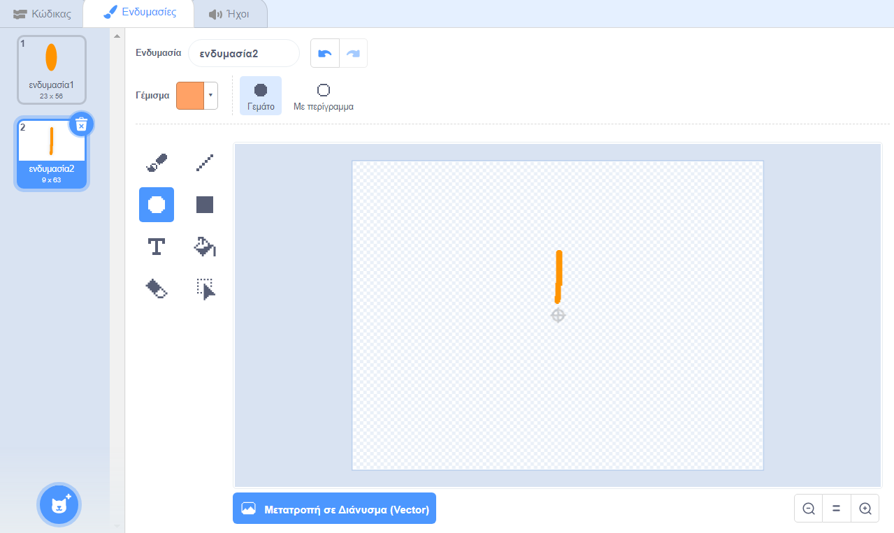

## Πρόκληση: δημιούργησε ένα σχέδιο λουλουδιών

Μπορείς να χρησιμοποιήσεις το μπλοκ `ζωγράφισε λουλούδι`{:class="block3myblocks"} πολλές φορές για να σχεδιάσεις περισσότερα λουλούδια και να δημιουργήσεις ένα ενδιαφέρον σχέδιο; Η σχεδίαση διαφορετικών λουλουδιών στην ίδια τοποθεσία δημιουργεί ένα ενδιαφέρον αποτέλεσμα.

Δημιούργησε ένα σχέδιο που σου αρέσει. Ακολουθεί ένα παράδειγμα:

Δεν χρειάζεται να χρησιμοποιήσεις πέταλα σε σχήμα έλλειψης. Για παράδειγμα, μπορείς να χρησιμοποιήσεις χοντρές ευθείες γραμμές και μαύρο φόντο για να δημιουργήσεις ένα μοτίβο πυροτεχνημάτων όπως αυτό:

Το «πέταλο» για τα πυροτεχνήματα είναι απλώς μια γραμμή:

Πρόσθεσε νέες ενδυμασίες πετάλων και θα δεις τι λουλούδια μπορεί να προκύψουν.

Δοκίμασε ένα αντικείμενο που δεν είναι γεμισμένο, όπως ένα τετράγωνο και δες τι συμβαίνει

