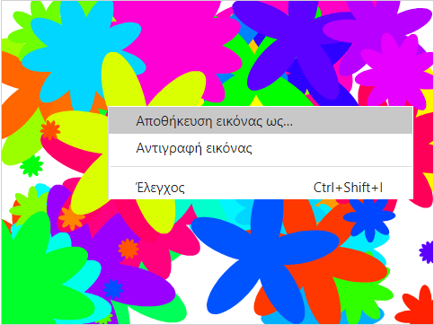

## Αποθήκευσε τις εικόνες σoυ

Όταν δημιουργείς μια εικόνα που σου αρέσει, μπορείς να την αποθηκεύσεις και να τη χρησιμοποιήσεις σε άλλο έργο Scratch, ως προφύλαξη οθόνης ή σε κάποιον ιστότοπο.

\--- task --

Όταν υπάρχει μια εικόνα στη σκηνή που σου αρέσει, κάνε δεξί κλικ και, στη συνέχεια, κάνε κλικ στο **Αποθήκευση εικόνας ως**

**Σημείωση:** Σε ορισμένους υπολογιστές ή προγράμματα περιήγησης, η επιλογή μενού για την αποθήκευση της εικόνας σου μπορεί να ονομάζεται κάπως διαφορετικά.

Στη συνέχεια, μπορείς να αποθηκεύσεις τη Σκηνή σου με μια εικόνα PNG.

\--- /task \---