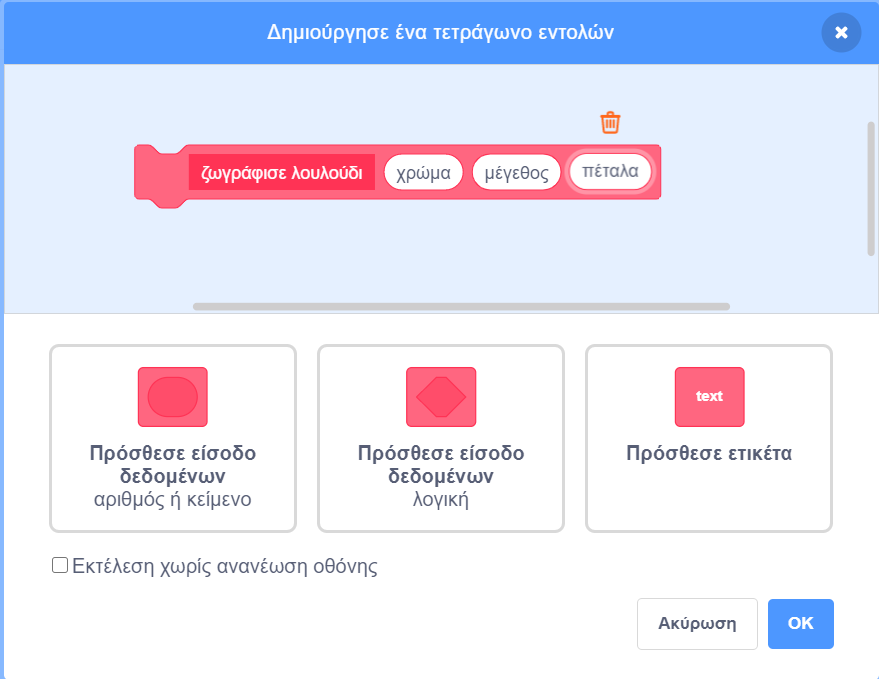

## Μοτίβα λουλουδιών

Μπορείς επίσης να χρησιμοποιήσεις την εντολή `ζωγράφισε λουλούδι`{:class="block3myblocks"} για να φτιάξεις όμορφα μοτίβα λουλουδιών.

--- task --

Δημιούργησε ένα λουλούδι ή ένα συνδυασμό λουλουδιών που σου αρέσουν. Ακολουθεί ένα παράδειγμα:


```blocks3
when [p v] key pressed
erase all
go to x: (-150) y: (100)
ζωγράφισε λουλούδι (150) (80) (7) :: custom
ζωγράφισε λουλούδι (130) (35) (20) :: custom
```

--- /task ---

--- task --

Πάτησε <kbd>p</kbd> για να δεις το λουλούδι σου. Το παράδειγμα μοιάζει με αυτό:


--- /task ---

Προτού δημιουργήσεις το μοτίβο που θέλεις, θα πρέπει να καθαρίσεις τη Σκηνή από τα υπόλοιπα λουλούδια.

--- task --

Κάνε κλικ στο `καθάρισε όλα` στο μενού Πένα.

```blocks3
erase all
```

--- /task ---

--- task --

Κάνε δεξί κλικ στο αντικείμενο λουλούδι και `εξαφανίσου`{:class="block3looks"} ώστε να μην εμφανίζεται στη σκηνή. (Μπορείς να `εμφανίσεις`{:class="block3looks"} το αντικείμενο ξανά αν χρειαστεί να δεις πού βρίσκεται.)

--- /task ---

--- task --

Τώρα σχεδίασε μια σειρά από αυτά τα λουλούδια στην κορυφή της Σκηνής. Ακολουθεί ένα παράδειγμα κώδικα, στον οποίο ίσως χρειαστεί να προσαρμόσεις τους αριθμούς έτσι ώστε να λειτουργεί για το λουλούδι σου:


```blocks3
when [p v] key pressed
erase all
go to x: (-150) y: (100)
repeat (4) 
  ζωγράφισε λουλούδι (150) (80) (7) :: custom
  ζωγράφισε λουλούδι (130) (35) (20) :: custom
  change x by (100)
end
```

--- /task ---

--- task ---

Πάτησε `p` για να δεις μια σειρά λουλουδιών:


--- /task ---

--- task ---

Πρόσθεσε έναν ακόμη βρόχο για να δημιουργήσεις περισσότερες σειρές λουλουδιών. Αυτό το παράδειγμα προσθέτει έναν βρόχο `επανάλαβε 3`{:class="block3control"} για τη δημιουργία τριών σειρών.


```blocks3
when [p v] key pressed
erase all
go to x: (-150) y: (100)
repeat (3) 
  repeat (4) 
    ζωγράφισε λουλούδι (150) (80) (7) :: custom
    ζωγράφισε λουλούδι (130) (35) (20) :: custom
    change x by (100)
  end
  set x to (-150)
  change y by (-100)
end
```

--- /task ---

--- task ---

Πάτησε <kbd>p</kbd> για να δημιουργήσεις ένα πλέγμα λουλουδιών:


--- /task ---

Θέλεις να επιταχύνεις τη σχεδίαση των λουλουδιών;

--- task ---

Κάνε δεξί κλικ στο `ορισμός ζωγράφισε λουλούδι`{:class="block3myblocks"} και επίλεξε **Επεξεργασία**. Κάνε κλικ στο **Εκτέλεση χωρίς ανανέωση οθόνης**.



Τώρα τα λουλούδια θα ζωγραφίζονται πολύ πιο γρήγορα.

--- /task ---

Μπορείς επίσης να αλλάξεις το χρώμα της Σκηνής.

--- task ---

Κάνε κλικ στο **Επίλεξε Υπόβαθρο** και, στη συνέχεια, κάνε κλικ στο **Ζωγραφική**. Δημιούργησε ένα πορτοκαλί φόντο χρησιμοποιώντας το εργαλείο Γέμισμα σε λειτουργία Bitmap.


Εάν χρησιμοποιήσεις πορτοκαλί για το σκηνικό και το λουλούδι, τότε οι αριθμοί για τα διαφορετικά χρώματα θα ταιριάζουν με το αντικείμενο και το σκηνικό.

--- /task ---

--- task ---

Τώρα μπορείς να χρησιμοποιήσεις το μπλοκ `όρισε εφέ χρώματος`{:class="block3looks"} στη Σκηνή για να αλλάξεις το χρώμα του Υπόβαθρου.


```blocks3
when [p v] key pressed
set [color v] effect to (30)
```

--- /task ---

--- task ---

Προσπάθησε να δημιουργήσεις ένα μοτίβο που σου αρέσει.

Ακολουθεί ένα παράδειγμα:


--- /task ---

Όταν τα συνδυάσεις όλα, μπορείς να δημιουργήσεις ένα εκπληκτικό εφέ:

