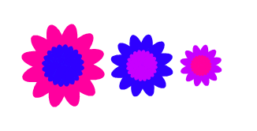

## Πρόκληση: προσαρμοσμένα μπλοκ λουλουδιών

Αυτά τα λουλούδια έχουν όλα τον ίδιο αριθμό εξωτερικών και εσωτερικών πετάλων και το μέγεθος του εσωτερικού λουλουδιού είναι ανάλογο με το εξωτερικό λουλούδι:



Μπορείς να δημιουργήσεις λουλούδια σαν αυτό με τη βοήθεια του προσαρμοσμένου μπλοκ `σχεδίασε διπλό λουλούδι`{:class="block3myblocks"} που έχει εισόδους για `εξωτερικό χρώμα`, `εσωτερικό χρώμα` και `μέγεθος`:

```blocks3
define σχεδίασε διπλό λουλούδι (εξωτερικό χρώμα) (εσωτερικό χρώμα) (μέγεθος :: custom-arg)
ζωγράφισε λουλούδι (εξωτερικό χρώμα :: custom-arg) (μέγεθος :: custom-arg) (12) :: custom
ζωγράφισε λουλούδι (εσωτερικό χρώμα :: custom-arg) ((μέγεθος :: custom-arg) / (2)) (20) :: custom
```

Το μπλοκ `σχεδίασε διπλό λουλούδι`{:class="block3myblocks"} μπορεί να σχεδιάσει πολλά λουλούδια με το ίδιο στυλ:

```blocks3
when [d v] key pressed
erase all
go to x: (-100) y: (0)
σχεδίασε διπλό λουλούδι (160) (120) (100) :: custom
change x by (100)
σχεδίασε διπλό λουλούδι (120) (140) (75) :: custom
change x by (75)
σχεδίασε διπλό λουλούδι (140) (160) (50) :: custom
```

Δημιούργησε νέο μπλοκ με τις απαραίτητες παραμέτρους εισόδου που θα μπορείς να αλλάζεις για να δημιουργείς έναν τύπο λουλουδιού που σου αρέσει.

Στη συνέχεια, χρησιμοποίησε το νέο σου μπλοκ για να δημιουργήσεις ένα εντυπωσιακό σχέδιο!