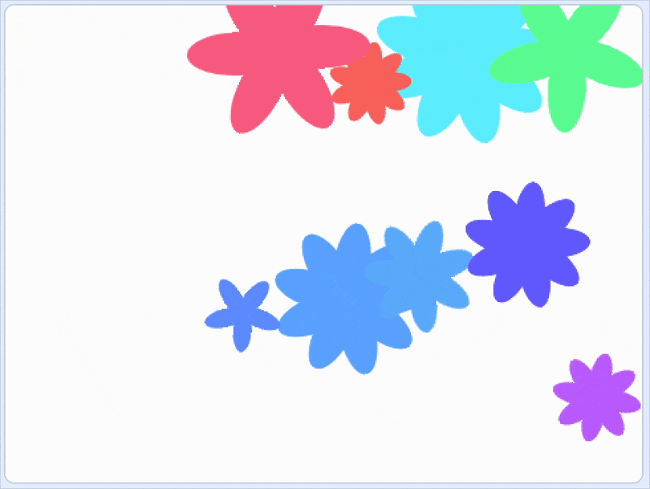

Create hundreds of flowers of different sizes, shapes, and colours. 

You can use the pictures you create as wallpaper on your phone or computer, or as backdrops in other Scratch projects. 

--- no-print ---

--- /no-print ---

--- print-only ---

--- /print-only ---

