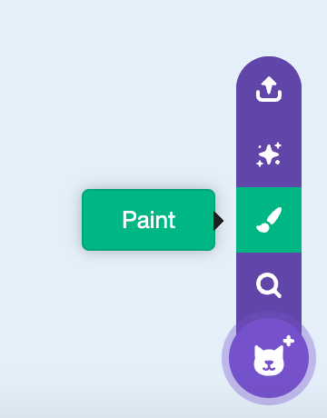
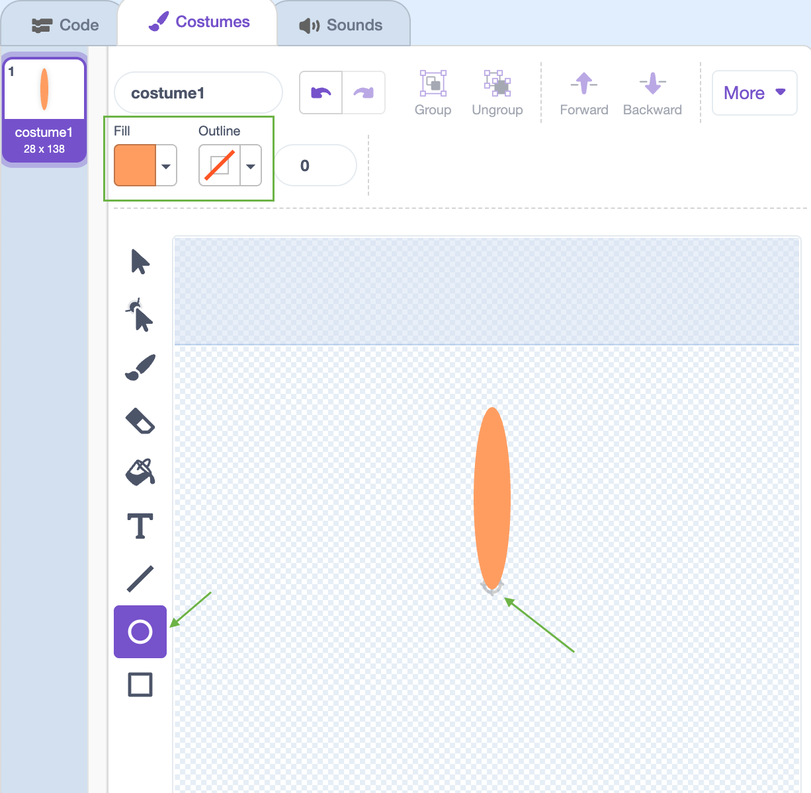
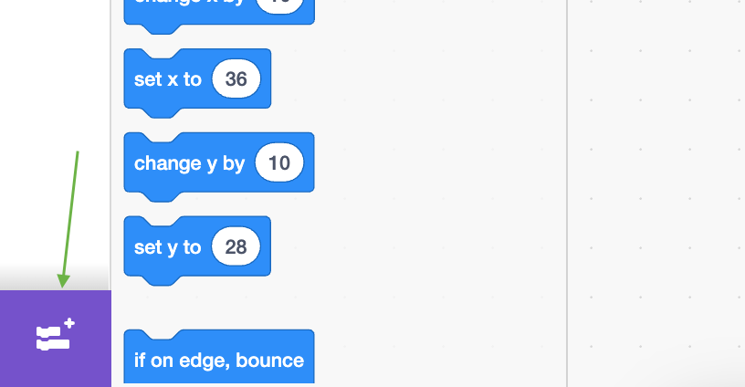

## Draw a flower

--- task ---

Create a [new Scratch project](https://scratch.mit.edu/projects/editor){:target="_blank"}, and delete the cat sprite.

--- /task ---

--- task ---

Hover on the **Choose a Sprite** menu, then click **Paint**. Name the sprite 'Flower'.


--- /task ---


--- task ---

Use the Circle tool to draw a petal shape filled in orange. Make sure that the bottom of the petal is in the centre.




--- /task ---

--- task ---

Click on the **Code** tab, then click on the **Blocks** menu and add the **Pen** extension.



--- /task ---

--- task ---

Add the following code to the Flower sprite to `stamp`{:class="block3extensions"} a flower with six equally rotated petals `when the green flag is clicked`{:class="block3control"}. 


```blocks3
when green flag clicked
repeat (6) 
  stamp
  turn cw (60) degrees
end
```
--- /task ---

--- task ---
Click the green flag to see your flower
--- /task ---