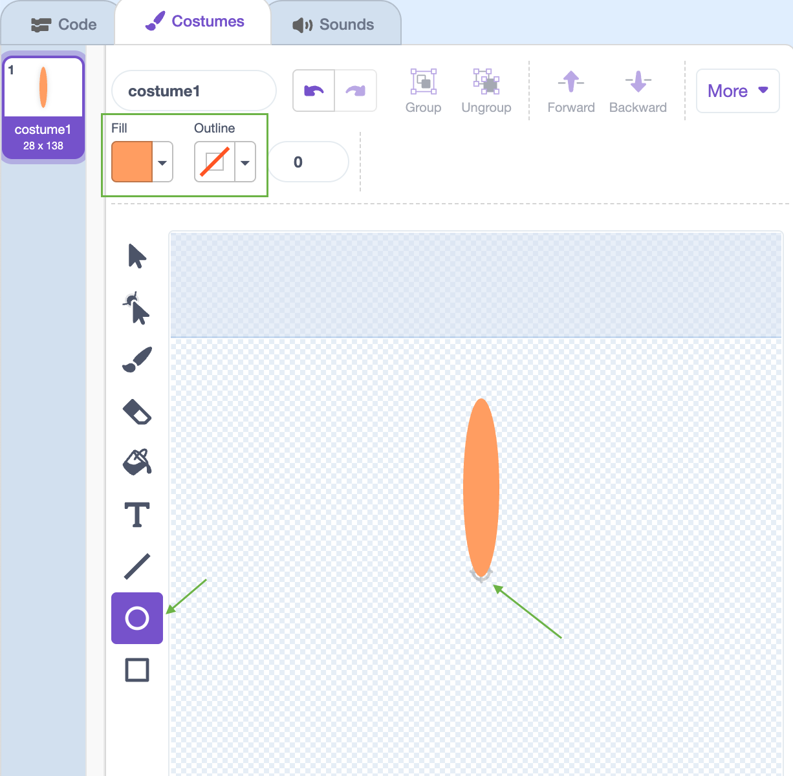

## Generating A Flower

First you're going to generate a flower with multiple petals that can be drawn on the screen. 

+ Create a new sprite named 'Flower' with the Paint tool. 

+ Switch to **Vector mode** and draw an orange filled in petal shape using the Ellipse tool (you'll use code to add colour later.) 

    

	Note: Shapes created using Vector mode look neater when you change their size. 

+ Add code to your Flower sprite to stamp a flower with 6 equally rotated petals when you click the green flag. 

	

--- hints ---
--- hint ---
You'll need to repeat the code to __stamp__ and __turn__ the petal 6 times. 
There are 360 degrees in a circle. Divide 360 by 6 to work out how many degrees each petal needs to be rotated by. 

You can click clear {.blockpen} to clear the stage. 
--- /hint ---
--- hint ---
Try using these blocks:

--- /hint ---
--- hint ---
Here's the code:

--- /hint ---
--- /hints ---

+ You may find that your petals are offset in an odd way:

	

	This is because the sprite is rotated around its center. 

+ Change where the center of your petal is using the crosshair tool:

	

	The center should be at the bottom center of the petal. 

+ Clear the stage and run your code again to check that the petals are straight: 

	

