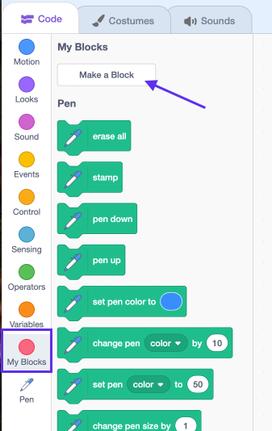

## Make a custom block to draw flowers

What if you want to draw lots of flowers? Instead of repeating the code, you can create your own block in Scratch and use it every time you want to draw a flower.  

--- task ---

Click on **More Blocks** and **Make a block** to create your own block and name it "draw flower".



--- /task ---

--- task ---

You will see a new block called `draw flower`{:class="blockmoreblocks"} under **More blocks** and a new definition block on the stage.

```block
draw flower :: custom

define draw flower
```

--- /task ---

--- task ---

Move your code for drawing the flower from the `when green flag clicked`{:class="blockevents"} block to the new `draw flower`{:class="blockmoreblocks"} definition block. 

Your code should look like this:

```block
define draw flower
repeat (6) 
  stamp
  turn cw (60) degrees
end

when green flag clicked
``` 

--- /task ---

--- task ---

Add the following code to clear the stage and use your new `draw flower`{:class="blockmoreblocks"} block when the green flag is clicked:

```block
when green flag clicked
clear
draw flower :: custom
```
 
--- /task ---

--- task ---

Click the green flag to test your code and make sure you see a flower. 

--- /task ---

--- task ---

Now change your code to move and draw another flower:

```block
when green flag clicked
clear
go to x: (75) y: (75)
draw flower :: custom
go to x: (-75) y: (-75)
draw flower :: custom 
```

--- /task ---

--- task ---

Test your code to check that you now see two flowers.

  
 
--- /task ---
