## Customise your flowers

At the moment all the flowers you draw are exactly the same. Next you're going to add some inputs to the `draw flower`{:class="block3myblocks"} block so that you can draw flowers with different colours, sizes, and numbers of petals. 

--- task ---

In Scratch you can use the `set colour effect`{:class="block3looks"} block to change the colour of a sprite. 

Change your 'draw flower' definition to change the colour: 

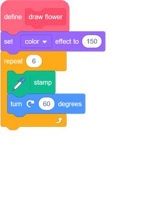

--- /task ---

--- task ---

Run your code to see flowers of different colours.

   

 `set colour effect`{:class="block3looks"} changes the colour based on the default colour of the sprite, so if your sprite doesn't start out orange, you get different results. 
 
--- /task ---

--- task ---

Experiment with using different numbers from `0` to `199` in the `set colour effect`{:class="block3looks"} block, and see what different results you get.

--- /task ---

At the moment all flowers are the same colour. To give each flower a different colour, you need to add an **input** to the `draw flower`{:class="block3myblocks"} block. 

--- task ---

Right-click on the `draw flower`{:class="block3myblocks"} definition block and choose **edit**:
 
  
 
--- /task ---

--- task ---

Now add a **input number** called 'colour': 

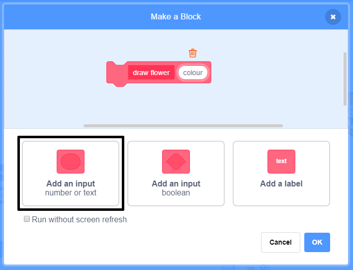  
 
The input appears in the `draw flower`{:class="block3myblocks"} definition, and you can drag it to where you want to use it.

--- /task ---

--- task ---

Drag the 'colour' input to the `set colour effect`{:class="block3looks"} block: 
 

Your code should look like this:

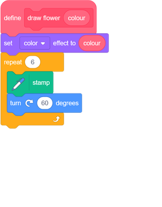
 
--- /task ---

Notice that your `draw flower`{:class="block3myblocks"} blocks now have a new input that is set to `1`: 

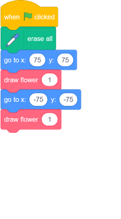

--- task ---

Change the numbers in the `draw flower`{:class="block3myblocks"} blocks so that the two flowers appear in different colours. You can pick any numbers between 0 and 200.

Your code should look similar to this:

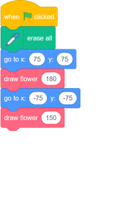

--- /task ---

--- task ---

Now add another input to set the size of the flower, so your `draw flower`{:class="block3myblocks"} block looks like this:

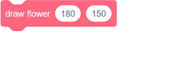

With the block above, you can create flowers with different sizes:

--- hints ---

--- hint ---

Look at what you did to add the `colour` input, and repeat it to add a 'size' input that you can use to set the size of the Flower sprite. 

--- /hint ---

--- hint ---

Edit the `draw flower`{:class="block3myblocks"} block to add a new number input called 'size'.

You need to add the following block with a 'size' input to the `draw flower`{:class="block3myblocks"} definition block:

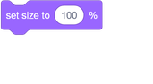

--- /hint ---

--- hint ---

Right-click on the `draw flower`{:class="block3myblocks"} definition block, click on **edit**, and add a number input called 'size'.

Change your `define draw flower`{:class="block3myblocks"} script so it looks like this:

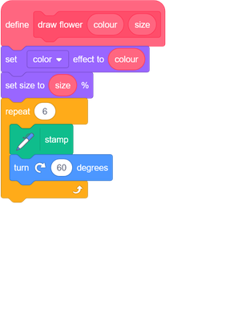

--- /hint ---

--- /hints ---

--- /task ---
--- task ---
In the `when green flag clicked`{:class="block3events"} script, change the second number in both `draw flower`{:class="block3myblocks"} blocks so that the two flowers appear in different sizes.

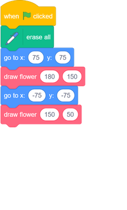
--- /task ---

--- task ---
Test your code to check whether the flowers have different sizes.
--- /task ---

--- task ---
It would be cool to choose the number of petals the flowers have.

Add another input so that you can draw flowers like this:

--- hints ---
--- hint ---

You need to add a 'petals' number input, and then use it in the `define draw flower`{:class="block3myblocks"} block. 

There are two places where you need to add the 'petals' input.

The number of degrees the Flower sprite should `turn`{:class="block3looks"} by is `360` divided by the number of petals. 

--- /hint ---

--- hint ---

Change your `define draw flower`{:class="block3myblocks"} block to look like this:

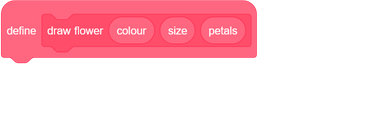

Update your `repeat`{:class="block3control"} and `turn`{:class="block3looks"} blocks so they use the 'petals' input.

Update your `draw flower`{:class="block3myblocks"} blocks to use the 'petals' input.

--- /hint ---

--- hint ---

Edit your `define draw flower`{:class="block3myblocks"} block and add a new number input called 'petals'.

Your code should look like this:

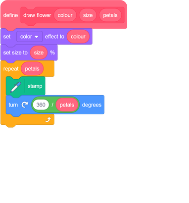

In the `when green flag clicked`{:class="block3events"} script, change the third number in both `draw flower`{:class="block3myblocks"} blocks so that the two flowers that appear have different numbers of petals.

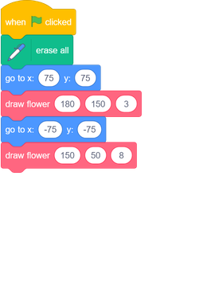

--- /hint ---

--- /hints ---

--- /task ---

Next, edit your code so you can draw different flowers by pressing the <kbd>f</kbd> key. 

--- task ---

Now move your code for drawing flowers away from below the `when green flag clicked`{:class="block3events"} block, and put the code under a `when f key pressed`{:class="block3events"} block.

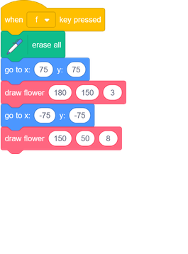

--- /task ---

--- task ---

Press <kbd>f</kbd> to test your code. 

--- /task ---

--- task ---

Add more `draw flower`{:class="block3myblocks"} blocks to your program to draw flowers with different colours, sizes, and numbers of petals all over the Stage.

--- /task ---
