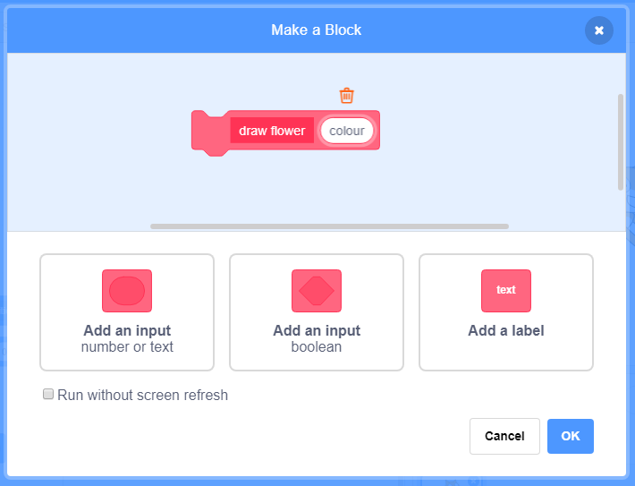

## Customise your flowers

At the moment all the flowers you draw are exactly the same. Let's add some inputs to the `draw flower`{:class="blockmoreblocks"} block so that flowers can be different colours and sizes, and can have different numbers of petals. 

--- task ---

In Scratch you can use the `set colour effect`{:class="blocklooks"} block to change the colour of a sprite. 

Change your 'draw flower' definition to change the colour: 


```blocks
define draw flower
set [color v] effect to (150)
repeat (6) 
  stamp
  turn cw (60) degrees
end
```

--- /task ---

--- task ---

Run your code to see flowers of different colours: 

   

 `set colour effect`{:class="blocklooks"} changes the colour based on the default colour of the sprite, so if you didn't use orange, you'll get different results. 
 
--- /task ---

--- task ---

Experiment with using different numbers from `0` to `199` in the `set colour effect`{:class="blocklooks"} block. 

--- /task ---

At the moment all flowers will be the same colour. We can add an **input** to the `draw flower`{:class="blockmoreblocks"} block to choose a different colour each time we use it. 

--- task ---

Right-click on the `draw flower`{:class="blockmoreblocks"} definition block and choose **edit**:
 
  
 

--- /task ---

--- task ---

Now add a **number input** called 'colour': 

  
 
The input will appear in the `draw flower`{:class="blockmoreblocks"} definition, and you can drag it to where you want to use it.

--- /task ---

--- task ---

Drag the 'colour' input to the `set colour effect`{:class="blocklooks"} block: 
 

 
Your code should look like this:


```blocks
define draw flower (colour)
set [color v] effect to (colour)
repeat (6) 
  stamp
  turn cw (60) degrees
end
```
 
--- /task ---

Notice that your `draw flower`{:class="blockmoreblocks"} blocks now have a new input which has been set to `1`: 

```blocks
when green flag clicked
clear
go to x: (75) y: (75)
draw flower (1) :: custom
go to x: (-75) y: (-75)
draw flower (1) :: custom
``` 

--- task ---

Change the numbers in the `draw flower`{:class="blockmoreblocks"} blocks so that the 2 flowers appear in different colours?. Pick any numbers between 0 and 200.

Your code should look similar to this:


```blocks
when green flag clicked
clear
go to x: (75) y: (75)
draw flower (180) :: custom
go to x: (-75) y: (-75)
draw flower (150) :: custom
```

--- /task ---

--- task ---

Now add another input to set the size of the flower so that you can write code like this...


```blocks
when green flag clicked
clear
go to x: (75) y: (75)
draw flower (180) (150) :: custom
go to x: (-75) y: (-75)
draw flower (150) (50) :: custom
```

...to create flowers of different sizes:


--- hints ---

--- hint ---

Look at what you did to add the `colour` input, and repeat it to add a `size` input which you can use to set the size of the sprite. 

--- /hint ---

--- hint ---

Edit the `draw flower`{:class="blockmoreblocks"} block, add a new number input and use the `set size`{:class="blocklooks"} block to change the size of the flower.

You'll need to use the following block with the 'size' input in your `draw flower`{:class="blockmoreblocks"} definition. 

```blocks
set size to (100) %

define draw flower (colour) (size :: custom-arg)
set [color v] effect to (colour)
repeat (6) 
  stamp
  turn cw (60) degrees
end
```

--- /hint ---

--- hint ---

Right-click on the draw flower definition block, choose edit and add a number input called `size`.


Change your `define draw flower`{:class="blockmoreblocks"} block to look like this:

```blocks
define draw flower (colour) (size :: custom-arg)
set [color v] effect to (colour)
set size to (size :: custom-arg) %
repeat (6) 
  stamp
  turn cw (60) degrees
end
```

Change the second set of numbers in the `draw flower`{:class="blockmoreblocks"} blocks so that the 2 flowers appear as different sizes.

```blocks 
when green flag clicked
clear
go to x: (75) y: (75)
draw flower (180) (150) :: custom
go to x: (-75) y: (-75)
draw flower (150) (50) :: custom
```

--- /hint ---

--- /hints ---

--- /task ---

--- task ---

How about changing the number of petals? Add another input so that you can choose the number of petals each flower has so that you can draw flowers like this:


--- hints ---
--- hint ---

You'll need to add a `petals` number input, and then use it in the `define draw flower`{:class="blockmoreblocks"} block. 

There are two places where you'll need to use the 'petals' input. The number of degrees you need to `turn`{:class="blocklooks"} the Flower sprite will be 360 divided by the number of petals. 

--- /hint ---

--- hint ---

Change your `define draw flower`{:class="blockmoreblocks"} block to look like this:


```blocks
define draw flower (colour) (size :: custom-arg) (petals)
```

Update your `repeat`{:class="blockcontrol"} and `turn`{:class="blocklooks"} blocks to use the number of petals.

```blocks
repeat (petals) 
end

turn cw ((360) / (petals :: custom-arg)) degrees
```

Update your `draw flower`{:class="blockmoreblocks"} blocks to use the number of petals.

```blocks
draw flower (150) (50) (8) :: custom
```

--- /hint ---

--- hint ---

Edit your `define draw flower`{:class="blockmoreblocks"} block and add a new number input called `petals`


Your code should now look like this:

```blocks
define draw flower (colour) (size :: custom-arg) (petals)
set [color v] effect to (colour)
set size to (size :: custom-arg) %
repeat (petals) 
  stamp
  turn cw ((360) / (petals)) degrees
end

```

Change the third set of numbers in the `draw flower`{:class="blockmoreblocks"} blocks so that the 2 flowers appear as with a different number of petals.

```blocks
when green flag clicked
clear
go to x: (75) y: (75)
draw flower (180) (150) (3) :: custom
go to x: (-75) y: (-75)
draw flower (150) (50) (8) :: custom
```

--- /hint ---

--- /hints ---

--- /task ---

--- task ---

Now move your flower drawing code under a `when f key pressed`{:class="blockevents"} block so you'll be able to draw different flowers when you press different keys. 


```blocks
when green flag clicked
```

```blocks
when [f v] key pressed
clear
go to x: (75) y: (75)
draw flower (180) (150) (3) :: custom
go to x: (-75) y: (-75)
draw flower (150) (50) (8) :: custom
```

--- /task ---

--- task ---

Press `f` to test your code. 

--- /task ---

--- task ---

Add more `draw flower`{:class="blockmoreblocks"} blocks to your program to place flowers with different colours, sizes and numbers of petals all over the stage.

--- /task ---
