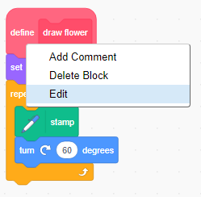

## Custom colours

At the moment all the flowers you draw are exactly the same. Next you're going to add some inputs to the `draw flower`{:class="block3myblocks"} block so that you can draw flowers with different colours, sizes, and numbers of petals. 

--- task ---

In Scratch you can use the `set color effect`{:class="block3looks"} block to change the colour of a sprite. 

Change your 'draw flower' definition to change the colour: 


```blocks3
define draw flower
+set [color v] effect to (150)
repeat (6) 
  stamp
  turn cw (60) degrees
end
```

--- /task ---

--- task ---

Run your code to see flowers of different colours.

   

 `set color effect`{:class="block3looks"} changes the colour based on the starting colour of the sprite, so if your sprite wasn't orange, you get different results. 
 
--- /task ---

--- task ---

Experiment with using different numbers from `0` to `199` in the `set color effect`{:class="block3looks"} block, and see what different results you get.

--- /task ---

At the moment all flowers are the same colour. To give each flower a different colour, you need to add an **input** to the `draw flower`{:class="block3myblocks"} block. 

--- task ---

Right-click on the `draw flower`{:class="block3myblocks"} definition block and choose **edit**:
 
  
 
--- /task ---

--- task ---

Now add a **input number** called 'colour': 

  
 
--- /task ---

--- task ---

Drag from the word 'colour' in the block header and use it to replace the number in the `set colour effect`{:class="block3looks"} block: 

Your code should look like this:


```blocks3
+define draw flower (colour)
+set [color v] effect to (colour :: custom-arg)
repeat (6)
  stamp
  turn cw (60) degrees
end
```
 
--- /task ---

--- task ---

Your `draw flower`{:class="block3myblocks"} blocks now have a number input. Change the number so that the two flowers appear in different colours. You can pick any numbers between 0 and 200.

Your code should look similar to this:


```blocks3
when green flag clicked
erase all
go to x: (75) y: (75)
+draw flower (180) :: custom
go to x: (-75) y: (-75)
+draw flower (150) :: custom
```

--- /task ---

--- task ---
Click the green flag and test that your program draws flowers in two different colours.

--- /task ---
