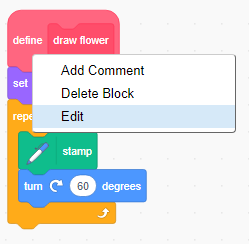
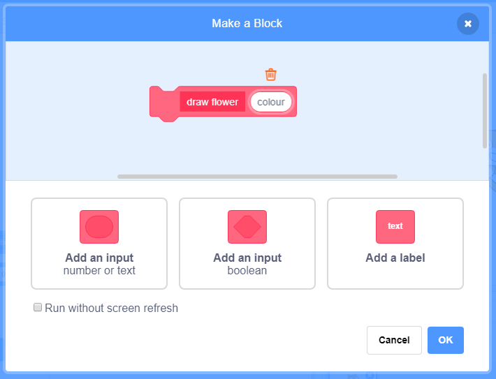
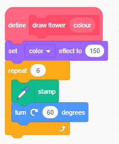

## Customise your flowers

At the moment all the flowers you draw are exactly the same. Let's add some inputs to the `draw flower` block so that flowers can be different colours and sizes, and can have different numbers of petals. 

+ In Scratch you can use the `set colour effect`{:class="blocklooks"} block to change the colour of a sprite. Change your 'draw flower' definition to change the colour: 

		
   
+ Run your code to see flowers of different colours: 

		

	`set colour effect`{:class="blocklooks"} changes the colour based on the default colour of the sprite, so if you didn't use orange, you'll get different results. 
	
+ Experiment with using different numbers from 0 to 199 in the `set colour effect` block. 
	
At the moment all flowers will be the same colour. We can add an **input** to the `draw flower` block to choose a different colour each time we use it. 

+ Right-click on the `draw flower`{:class="blockmoreblocks"} definition block and choose **edit**:
	
		
	
+ Now add a **number input** called 'colour': 

		
	
The input will appear in the `draw flower`{:class="blockmoreblocks"} definition, and you can drag it to where you want to use it.

+ Drag the 'colour' input to the `set colour effect`{:class="blocklooks"} block: 
	
	
	
+ Your code should look like this:

	
	
+ Notice that your `draw flower`{:class="blockmoreblocks"} blocks now have a new input: 

	
	
+ Change the numbers in `draw flower`{:class="blockmoreblocks"} so that the flowers which appear are different colours. Pick any numbers between 0 and 200.

	
	
+ Now add another input to set the size of the flower so that you can write code like this...

	

	...to create flowers of different sizes:

	
	
--- hints ---
--- hint ---
Look at what you did to add the 'colour' input, and repeat it to add a 'size' input which you can use to set the size of the sprite. 
--- /hint ---
--- hint ---
You'll need to use the following block with the 'size' input in your `draw flower`{:class="blockmoreblocks"} definition. 

--- /hint ---
--- hint ---
Your code should look like this:

--- /hint ---
--- /hints ---

+ How about changing the number of petals? Add another input so that you can choose the number of petals each flower has so that you can draw flowers like this:

	

--- hints ---
--- hint ---
You'll need to add a 'petals' number input, and then use it in the definition of the `draw flower`{:class="blockmoreblocks"} block. 

There are two places where you'll need to use the 'petals' input. The number of degrees you need to rotate the Flower sprite will be 360 divided by the number of petals. 
--- /hint ---
--- hint ---
You'll need to use the following block to work out how many degrees to turn:

--- /hint ---
--- hint ---
Your code should look like this:

--- /hint ---
--- /hints ---

+ Now move your flower drawing code under a `when f key pressed` block so you'll be able to draw different flowers when you press different keys. 

	
	
+ Press `f` to test your code. 

	

 
