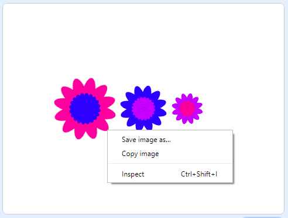

## Saving the stage

If you've created a pattern you like you can save it to use in another Scratch project or as a screensaver or on a web site. 

+ When you have a pattern on the stage that you like you can right-click and choose 'save stage'

		
	
	This allows you to save a '.png' image of the stage. 
	
	Choose a sensible file name and location to save.
	
	