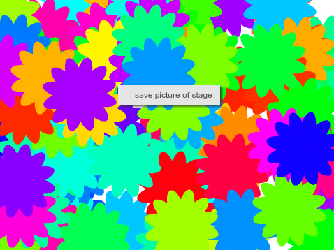

## Saving the stage

If you've created a pattern you like, you can save it and use it in another Scratch project, or as a screensaver or on a web site. 

--- task ---

When you have a pattern on the stage that you like, you can right-click and choose **save picture of stage** (on some computers you may need to hold down the `Shift` key when you right-click). 

   
 
 This allows you to save a PNG image of the stage. 
 

--- /task ---

Choose a sensible file name and location to save.
 
 
