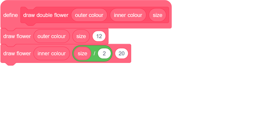
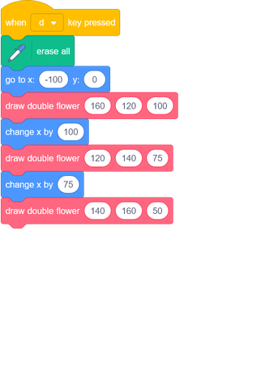

## Challenge: custom flower blocks

These flowers all have the same number of outer and inner petals, and the size of the inner flower is in proportion to the outer flower: 
 

You can create flowers like this with the help of a `draw double flower`{:class="block3myblocks"} custom block that has inputs for `outer colour`, `inner colour`, and `size`:

The `draw double flower`{:class="block3myblocks"} block can draw lots of flowers in the same style:

Make a new custom block with the necessary inputs that you need to be able to change to create a type of flower that you like.

Then use your new block to create a cool design! 
