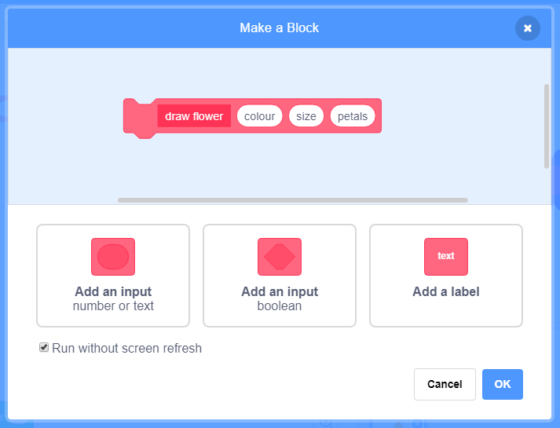

--- challenge ---

## Challenge: flower patterns

You can also use your `draw flower` block to create neat flower patterns. 

+ Create a flower or a combination of flowers that you like. Here's an example:

		
	
+ Press `p` to see your flower. The example looks like this:

		
	
+ Right-click on the Flower sprite and `hide` it so it doesn't appear on the stage. (You can show the sprite again if you need to see where it is.)

+ Now draw a row of these flowers across the top of the stage. Here's an example, but you might need to adjust the numbers to work with your flower:

	
	
+ Press `p` to see a row of flowers: 

	
	
+ Add another loop to create more rows of flowers. This example adds a `repeat 3` loop to create three rows. 

	
	
+ Press `p` to see a grid of flowers: 

	
	
+ Do you want to speed up the drawing of the flowers? Right-click on the `draw flower` definition block and choose **edit**. Tick the **Run without screen refresh** box. 

	
	
	Now the flowers will be drawn more quickly. 

+ You can also change the colour of the stage. Click on **Paint new backdrop**. Create an orange backdrop by using the Fill tool in Bitmap mode. 

	
	
	Using orange means that the numbers for different colours will match the ones for the petal. 
	
+ Now you can use the `set colour effect` on the stage to change the colour of the backdrop.
	
	
	
+ Try different things to create a pattern you like. 

	Here's an example: 
	
	
	
+ Put it all together to create an amazing effect:

	

--- /challenge ---

