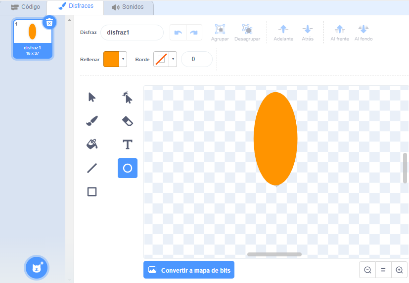
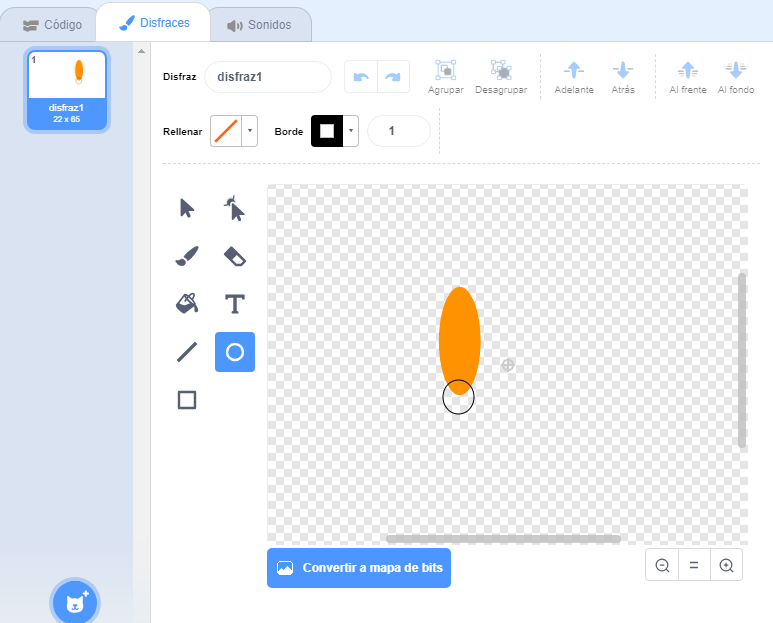

## Crea una flor

Primero vas a generar una flor que puede ser dibujada en el área de trabajo.

\--- task \---

Comienza un nuevo proyecto de Scratch y elimina el objeto del gato.

[[[generic-scratch3-new-project]]]

\--- /task \---

\--- task \---

Añade la extensión Lápiz a tu proyecto.

[[[generic-scratch3-add-pen-extension]]]

\--- /task \---

\--- task \---

Ahora usa la herramienta Pinta para crear un nuevo objeto con forma de pétalo de flor.

Haz clic en **Elige un objeto**, luego haz clic en **Pinta** y renombra el objeto a 'Flor'.

[[[generic-scratch3-draw-sprite]]]

\--- /task \---

\--- task \---

Usa la herramienta Círculo para hacer un dibujo en forma de pétalo relleno de color naranja.



Después, usarás código para añadir más color.

\--- /task \---

\--- task \---

Añade el siguiente código al objeto Flor para `sellar`{: class = "block3extensions"} una flor con seis pétalos rotados igualmente ` cuando se haga clic en la bandera verde ` {: class = "block3control"}.


```blocks3
when green flag clicked
repeat (6) 
  stamp
  turn cw (60) degrees
end
```

\--- /task \---

Puede que encuentres que tus pétalos están organizados de una manera extraña:


Esto se debe a que el objeto se está girando alrededor de su centro.

\--- task \---

Mueve tu pétalo para que su parte inferior quede en el centro.



Hacer esto puede ser más fácil si alejas el zoom.

\--- /task \---

Antes de volver a ejecutar tu código, deberías `borrar todos`{:class="block3extensions"} los objetos en el área de trabajo para limpiarlo.

\--- task \---

Haz clic en el bloque `borrar todo` en la sección de bloques del Lápiz.

```blocks3
erase all
```

\--- /task \---

\--- task \---

Ejecuta tu código nuevamente para verificar que los pétalos de la flor ahora estén rectos.


Si no es así, ajusta la posición del pétalo hasta su fondo este situado sobre el centro.

\--- /task \---