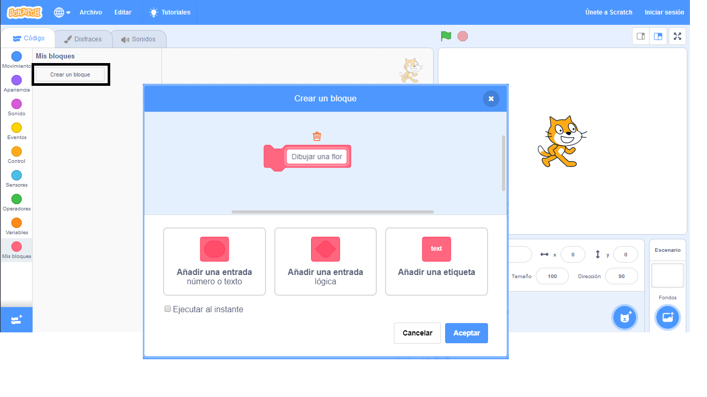

## Haz un bloque personalizado para dibujar flores

¿Qué pasa si quieres dibujar un montón de flores? En lugar de hacer muchas copias del código, crearás tu propio bloque en Scratch y lo usarás cada vez que quieras dibujar una flor.

\--- task \---

Haz clic en **Mis bloques** y luego en **Crear un bloque** para crear tu propio bloque llamado 'dibuja una flor'.



\--- /task \---

\--- task \---

Ahora hay un nuevo bloque llamado `dibuja una flor`{:class="block3myblocks"} en la sección **Mis bloques**, y un nuevo bloque de definición en el área de trabajo.

```blocks3
draw flower :: custom

define draw flower
```

\--- /task \---

\--- task \---

Mueve tu código para dibujar una flor desde el bloque `al hacer clic en la bandera verde`{:class="block3events"} al nuevo bloque `dibuja una flor`{:class="block3myblocks"}.

Tu código debe parecerse a esto:


```blocks3
define draw flower
repeat (6) 
  stamp
  turn cw (60) degrees
end

when green flag clicked
```

\--- /task \---

\--- task \---

Añade el siguiente código para limpiar el Escenario y usar tu nuevo bloque `dibuja una flor`{:class="block3myblocks"} cuando se haga clic en la bandera verde:


```blocks3
when green flag clicked
erase all
draw flower :: custom
```

\--- /task \---

\--- task \---

Haz clic en la bandera verde para probar tu código y comprobar si ves una flor.

\--- /task \---

\--- task \---

Ahora cambia tu código para mover el objeto y luego dibuja otra flor:


```blocks3
when green flag clicked
erase all
go to x: (75) y: (75)
draw flower :: custom
go to x: (-75) y: (-75)
draw flower :: custom 
```

\--- /task \---

\--- task \---

Prueba tu código para comprobar que ahora ves dos flores.


\--- /task \---