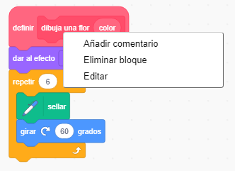
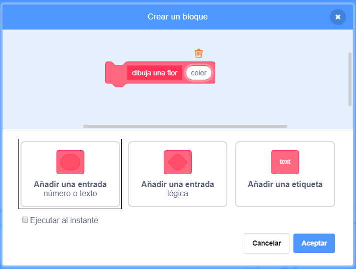
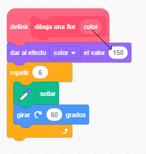

## Personaliza tus flores

Por el momento todas las flores que dibujas son exactamente iguales. A continuación añadirás algunas entradas al bloque `dibuja una flor`{:class="block3myblocks"} para que puedas dibujar flores con diferentes colores, tamaños, y números de pétalos.

\--- task \---

En Scratch puedes usar el bloque `dar al efecto color el valor de`{:class="block3looks"} para cambiar el color de un objeto.

Cambia tu definición de "dibuja una flor" para cambiar el color:


```blocks3
define draw flower
set [color v] effect to (150)
repeat (6) 
  stamp
  turn cw (60) degrees
end
```

\--- /task \---

\--- task \---

Ejecuta tu código para ver flores de diferentes colores.


`dar el efecto color el valor`{:class="block3looks"} cambia el color basandose en el color predeterminado del objeto así que si tu objeto al principio no era de color naranja, obtendrás resultados diferentes.

\--- /task \---

\--- task \---

Experimenta con el uso de diferentes números desde el `0` al `199` en el bloque `dar el efecto color el valor`{:class="block3looks"} y ver los diferentes resultados obtenidos.

\--- /task \---

Por el momento, todas las flores son del mismo color. Para dar a cada flor un color diferente, tienes que añadir una **entrada** al bloque `dibuja una flor`{:class="block3myblocks"}.

\--- task \---

Haz clic derecho en el bloque de definición `dibuja una flor`{:class="block3myblocks"} y elije **editar**:



\--- /task \---

\--- task \---

Ahora añade una **entrada (número o texto)** llamada 'color':



La entrada aparece en la definición `dibuja la flor`{:class="block3myblocks"}, y puedes arrastrarla a donde quieras usarla.

\--- /task \---

\--- task \---

Arrastra la entrada 'color' al bloque `dar al efecto color el valor de`{:class="block3looks"}:



Tu código debe parecerse a este:


```blocks3
define draw flower (colour)
set [color v] effect to (colour :: custom-arg)
repeat (6)
  stamp
  turn cw (60) degrees
end
```

\--- /task \---

Ten en cuenta que los bloques `dibuja una flor`{:class="block3myblocks"} ahora tienen una nueva entrada establecida en `1`:

```blocks3
when green flag clicked
erase all
go to x: (75) y: (75)
draw flower (1) :: custom
go to x: (-75) y: (-75)
draw flower (1) :: custom
```

\--- task \---

Cambia los números en los bloques `dibuja una flor`{:class="block3myblocks"} para que las dos flores aparezcan en diferentes colores. Puedes elegir cualquier número entre 0 y 200.

Tu código debe parecerse a esto:


```blocks3
when green flag clicked
erase all
go to x: (75) y: (75)
draw flower (180) :: custom
go to x: (-75) y: (-75)
draw flower (150) :: custom
```

\--- /task \---

\--- task \---

Ahora añade otra entrada para establecer el tamaño de la flor, así que tu bloque `dibuja una flor`{:class="block3myblocks"} se vera así:


```blocks3
draw flower (180) (150) :: custom
```

Con el bloque de arriba, puedes crear flores con diferentes tamaños:


\--- hints \---

\--- hint \---

Mira lo que has hecho para añadir la entrada `color`, y repítelo para añadir una entrada 'tamaño' que podrás usar para establecer el tamaño del objeto flor.

\--- /hint \---

\--- hint \---

Editar el bloque `dibuja una flor`{:class="block3myblocks"} para añadir una nueva entrada de número llamada 'tamaño'.

Necesitas añadir el siguiente bloque con una entrada de 'tamaño' al bloque de definición `dibuja la flor`{:class="block3myblocks"}:

```blocks3
set size to (100) %
```

\--- /hint \---

\--- hint \---

Haz clic derecho en el bloque de definición `dibuja una flor`{:class="block3myblocks"}, haz clic en **editar**, y añade una entrada numerica llamada 'tamaño'.


Cambia tu bloque de código `definir dibuja una flor`{:class="block3myblocks"} para que se vea así:

```blocks3
define draw flower (colour) (size :: custom-arg)
set [color v] effect to (colour :: custom-arg)
set size to (size :: custom-arg) %
repeat (6) 
  stamp
  turn cw (60) degrees
end
```

\--- /hint \---

\--- /hints \---

\--- /task \--- \--- task \---

En el bloque del código `al hacer clic en la bandera verde`{:class="block3events"}, cambia el segundo número en ambos bloques `dibuja una flor`{:class="block3myblocks"} para que las dos flores aparezcan en diferentes tamaños.

```blocks3
when green flag clicked
erase all
go to x: (75) y: (75)
draw flower (180) (150) :: custom
go to x: (-75) y: (-75)
draw flower (150) (50) :: custom
```

\--- /task \---

\--- task \---

Prueba tu código para comprobar si las flores tienen diferentes tamaños.

\--- /task \---

\--- task \---

Sería genial elegir el número de pétalos que tienen las flores.

Añade otra entrada para que puedas dibujar flores así:


\--- hints \--- \--- hint \---

Necesitas añadir una entrada de número 'pétalos' y luego usarla en el bloque `definir dibuja una flor`{:class="block3myblocks"}.

Hay dos lugares donde necesitas añadir la entrada de los pétalos.

El número de grados por los que el objeto de flor debe `girar`{:class="block3looks"} es `360` dividido entre el número de pétalos.

\--- /hint \---

\--- hint \---

Cambia tu código `definir dibuja una flor`{:class="block3myblocks"} para que se vea así:


```blocks3
define draw flower (colour) (size :: custom-arg) (petals)
```

Actualiza tus bloques `repetir`{:class="block3control"} y `girar`{:class="block3looks"} para que usen la entrada 'pétalos'.

```blocks3
repeat (petals :: custom-arg) 
end

turn cw ((360) / (petals :: custom-arg)) degrees
```

Actualiza tus bloques `dibuja una flor`{:class="block3myblocks"} para usar la entrada 'pétalos'.

```blocks3
draw flower (150) (50) (8) :: custom
```

\--- /hint \---

\--- hint \---

Edita el bloque `dibuja una flor`{:class="block3myblocks"} para añadir una nueva entrada de número llamada 'pétalos'.


Tu código debe parecerse a esto:

```blocks3
define draw flower (colour) (size :: custom-arg) (petals)
set [color v] effect to (colour :: custom-arg)
set size to (size :: custom-arg) %
repeat (petals :: custom-arg) 
  stamp
  turn cw ((360) / (petals :: custom-arg)) degrees
end

```

En el bloque de código `al hacer clic en la bandera verde`{:class="block3events"}, cambia el segundo número en ambos bloques `dibuja una flor`{:class="block3myblocks"} para que las dos flores aparezcan en diferentes tamaños.

```blocks3
when green flag clicked
erase all
go to x: (75) y: (75)
draw flower (180) (150) (3) :: custom
go to x: (-75) y: (-75)
draw flower (150) (50) (8) :: custom
```

\--- /hint \---

\--- /hints \---

\--- /task \---

A continuación, edita tu código para que puedas dibujar diferentes flores pulsando la tecla <kbd>f</kbd>.

\--- task \---

Ahora mueve el código para dibujar flores que está debajo del bloque `al hacer clic en la bandera verde`{:class="block3events"}, y ponlo bajo un bloque `al presionar la tecla f`{:class="block3events"}.


```blocks3
when green flag clicked
```

```blocks3
when [f v] key pressed
erase all
go to x: (75) y: (75)
draw flower (180) (150) (3) :: custom
go to x: (-75) y: (-75)
draw flower (150) (50) (8) :: custom
```

\--- /task \---

\--- task \---

Pulsa <kbd>f</kbd> para probar tu código.

\--- /task \---

\--- task \---

Añade más bloques `dibuja una flor`{:class="block3myblocks"} a tu programa para dibujar flores con diferentes colores, tamaños y números de pétalos por todo el Escenario.

\--- /task \---