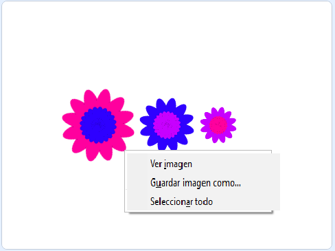

## Guarda tus imágenes

Cuando creas una imagen que te gusta, puedes guardarla y usarla en otro proyecto de Scratch, también como salvapantallas o en un sitio web.

\--- task \---

Cuando haya una imagen que te guste, haz clic derecho en ella y luego haz clic en **guardar imagen como**

**Nota:** en algunos ordenadores o navegadores, la opción de menú para guardar tu imagen puede tener un nombre diferente.

Entonces puedes guardar una imagen PNG de tu Escenario.

\--- /task \---