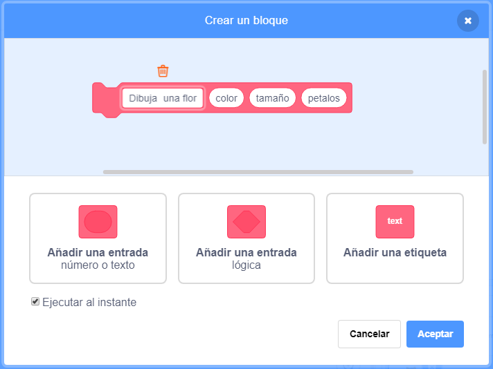
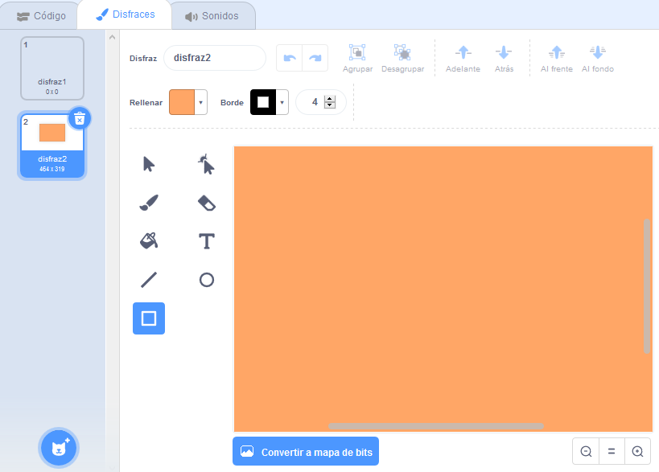

## Patrones de flores

También puedes usar tu bloque `dibuja una flor`{:class="block3myblocks"} para crear patrones de flores nítidas.

\--- task \---

Crea una flor o una combinación de flores que quieras. Aquí está un ejemplo:


```blocks3
when [p v] key pressed
erase all
go to x: (-150) y: (100)
draw flower (150) (80) (7) :: custom
draw flower (130) (35) (20) :: custom
```

\--- /task \---

\--- task \---

Pulsa <kbd>p</kbd> para ver tu flor. El ejemplo se ve así:


\--- /task \---

Antes de que puedas crear tu patrón, debes limpiar el Escenario de cualquier flor sobrante.

\--- task \---

Haz clic en el bloque `borrar todo` en la sección de Lápiz.

```blocks3
erase all
```

\--- /task \---

\--- task \---

Haz clic derecho en el objeto de flores y `escondelo`{:class="block3looks"} para que no aparezca en el Escenario. (Puedes `mostrar`{:class="block3looks"} el objeto de nuevo si necesitas ver dónde está.)

\--- /task \---

\--- task \---

Ahora dibuja una fila de estas flores a lo largo de la parte superior del Escenario. Aquí hay un código de ejemplo, en el que puede que necesite ajustar los números para que quede bien con tu flor:


```blocks3
when [p v] key pressed
erase all
go to x: (-150) y: (100)
repeat (4) 
  draw flower (150) (80) (7) :: custom
  draw flower (130) (35) (20) :: custom
  change x by (100)
end
```

\--- /task \---

\--- task \---

Pulsa `p` para ver una fila de flores:


\--- /task \---

\--- task \---

Añade otro bicle para crear más filas de flores. Este ejemplo añade un bucle `repetir 3`{:class="block3control"} para crear tres filas.


```blocks3
when [p v] key pressed
erase all
go to x: (-150) y: (100)
repeat (3) 
  repeat (4) 
    draw flower (150) (80) (7) :: custom
    draw flower (130) (35) (20) :: custom
    change x by (100)
  end
  set x to (-150)
  change y by (-100)
end
```

\--- /task \---

\--- task \---

Pulsa <kbd>p</kbd> para crear una cuadrícula de flores:


\--- /task \---

¿Quieres acelerar el dibujo de las flores?

\--- task \---

Haz clic derecho en el bloque de definición `dibuja una flor`{:class="block3myblocks"} y luego haz clic en **editar**. Haz clic en la caja **Ejecutar al instante**.



Ahora las flores se dibujan más rápidamente.

\--- /task \---

También puedes cambiar el color del Escenario.

\--- task \---

Haz clic en **Elija un fondo**, y luego haga clic en **Pintar**. Crea un fondo naranja usando la herramienta de relleno en modo mapa de bits.



Si usas naranja para el fondo y el objeto flor, entonces los números para diferentes colores coincidirán para el objeto y el fondo.

\--- /task \---

\--- task \---

Ahora puedes usar `dar al efecto color el valor`{:class="block3looks"} en el Escenario para cambiar el color del fondo.


```blocks3
when [p v] key pressed
set [color v] effect to (30)
```

\--- /task \---

\--- task \---

Intenta crear un patrón que te guste.

Aquí tienes un ejemplo:


\--- /task \---

Cuando lo juntas todo, puedes crear un efecto increíble:

