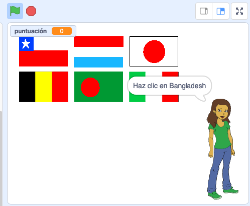

## ¿Qué sigue?

Prueba nuestro proyecto [Adivina la bandera](https://projects.raspberrypi.org/es-LA/projects/guess-the-flag?utm_source=pathway&utm_medium=whatnext&utm_campaign=projects) donde puedes crear tu propio concurso de banderas para ponerte a prueba a ti y a tus amigos.

--- no-print ---

Haz clic en la bandera del país que corresponde.

  <iframe allowtransparency="true" width="485" height="402" src="https://scratch.mit.edu/projects/embed/417343292/?autostart=false" frameborder="0" scrolling="no"></iframe>

--- /no-print ---

--- print-only ---

--- /print-only ---

***
Este proyecto fue traducido por voluntarios:

Margarita Quiroz-Cariga (Fitzpatrick)

Daniela Flores Martell

Talía Bonatto

Verónica Valencia Límaco

Gracias a los voluntarios, podemos dar a las personas de todo el mundo la oportunidad de aprender en su propio idioma. Puedes ayudarnos a llegar a más personas ofreciéndote como voluntario para traducir. Más información en [rpf.io/translate](https://rpf.io/translate).