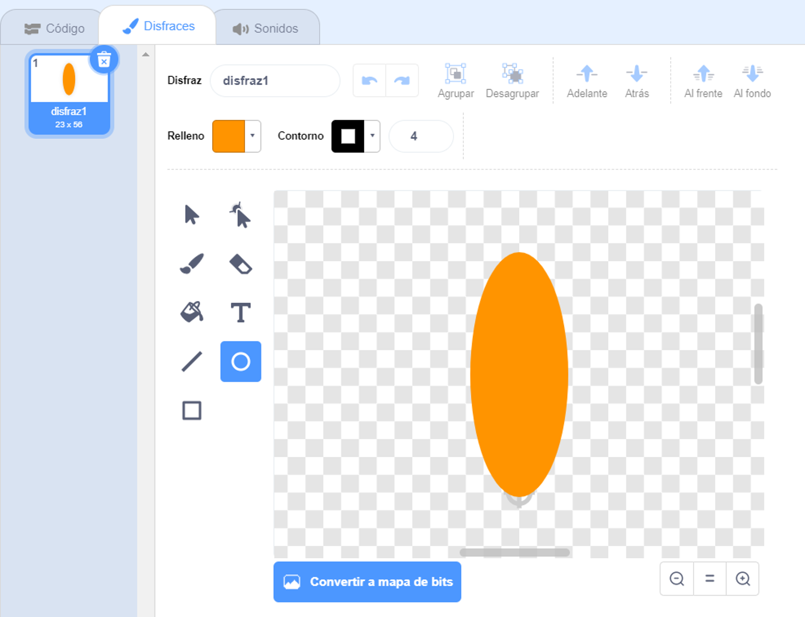
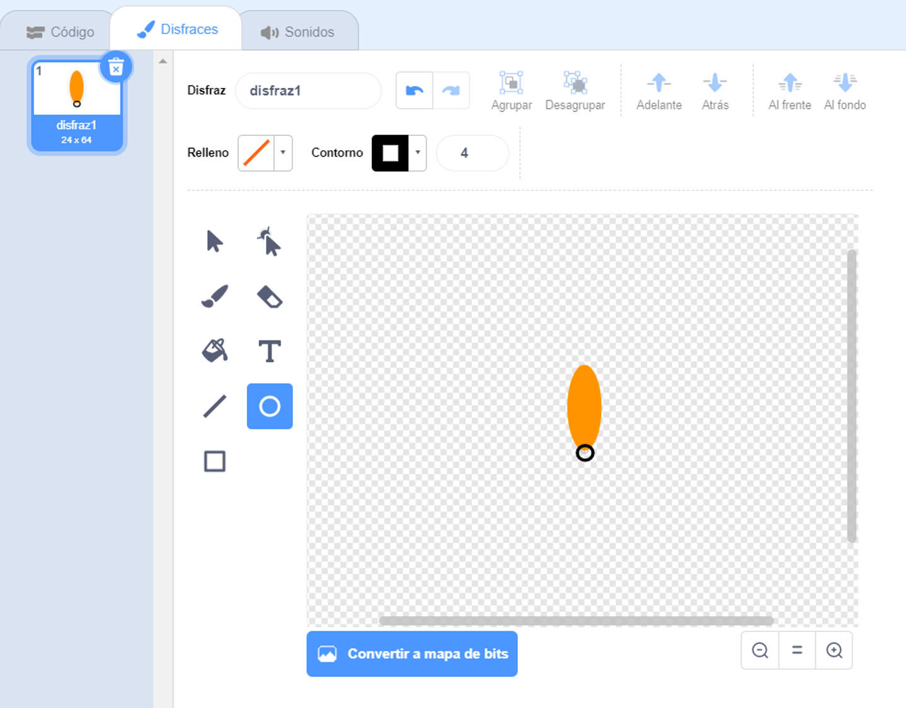

## Generar una flor

Primero vas a generar una flor que se puede dibujar en el Escenario.

\--- task \---

Comienza un nuevo proyecto de Scratch, y elimina el objeto del gato.

[[[generic-scratch3-new-project]]]

\--- /task \---

\--- task \---

Añade la extensión Lápiz a tu proyecto.

[[[generic-scratch3-add-pen-extension]]]

\--- /task \---

\--- task \---

Ahora usa la herramienta Pintura para crear un nuevo objeto con forma de pétalo de flor.

Haz clic en **Elige un objeto**, luego haz clic en **Pintura** y renombra el objeto 'Flor'.

[[[generic-scratch3-draw-sprite]]]

\--- /task \---

\--- task \---

Use la herramienta Círculo para dibujar una forma de pétalo y coloréala de naranja.



Después, usarás código para añadir más color.

\--- /task \---

\--- task \---

Añade el siguiente código al objeto de Flor para `sellar`{:class="block3extensions"} una flor con seis pétalos iguales `al presionar ⚑`{:class="block3control"}.


```blocks3
when green flag clicked
repeat (6) 
  stamp
  turn cw (60) degrees
end
```

\--- /task \---

Puede que los pétalos estén organizados de una manera extraña:


Esto se debe a que el objeto está girando alrededor de su centro.

\--- task \---

Mueve tu pétalo para que su parte inferior esté en el centro.



Hacer esto puede ser más fácil si agrandas la imagen.

\--- /task \---

Antes de volver a ejecutar tu código, deberías `borrar todos`{:class="block3extensions"} los objetos en el Escenario para limpiarlo.

\--- task \---

Haz clic en `borrar todo` bloque en la sección de bloques de Lapicero.

```blocks3
erase all
```

\--- /task \---

\--- task \---

Ejecuta tu código nuevamente para verificar que los pétalos de la flor estén derechos esta vez.


De lo contrario, ajusta la posición del pétalo hasta que su parte inferior esté en el centro.

\--- /task \---