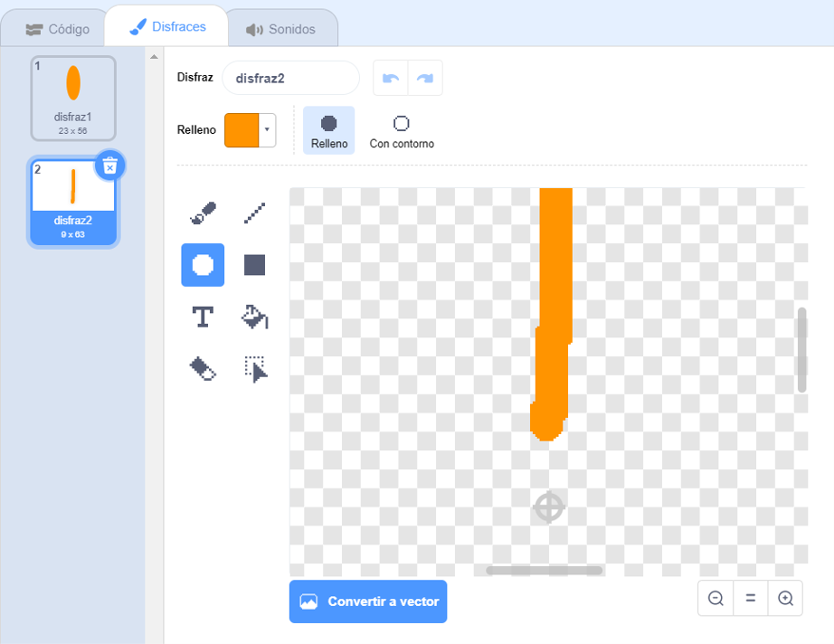

## Desafío: crea un diseño de flores

¿Puedes usar tu bloque `dibujar flor`{:class="block3myblocks"} varias veces para dibujar más flores y crear un diseño interesante? Dibujar diferentes flores en la misma ubicación crea un efecto interesante.

Crea un diseño que te guste. Aquí tienes un ejemplo:

No tienes que usar pétalos con forma de elipses. Por ejemplo, puedes usar líneas rectas gruesas y un fondo negro para crear un patrón de fuegos artificiales como este:

El "pétalo" para el patrón de fuegos artificiales es sólo una línea:

Agrega nuevos estilos de pétalos y descubre las diferentes flores que puedes crear.

Prueba una forma de objeto que no tenga relleno, como un cuadrado, y mira lo qué pasa

