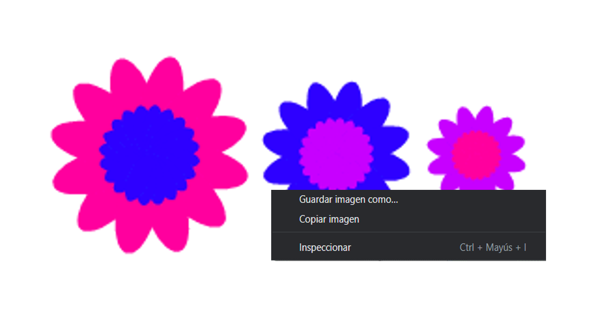

## Guardar tus imágenes

Cuando creas una imagen que te guste, puedes guardarla y usarla en otro proyecto de Scratch como protector de pantalla o en un sitio web.

\--- task \---

Cuando haya una imagen en el Escenario que te guste, haz un clic derecho en ella y luego haz clic en **guardar imagen como**

**Nota:** en algunas computadoras o navegadores, la opción de menú para grabar tu imagen podría tener un nombre diferente.

Luego, podrás grabarlo como una imagen PNG en el Escenario.

\--- /task \---