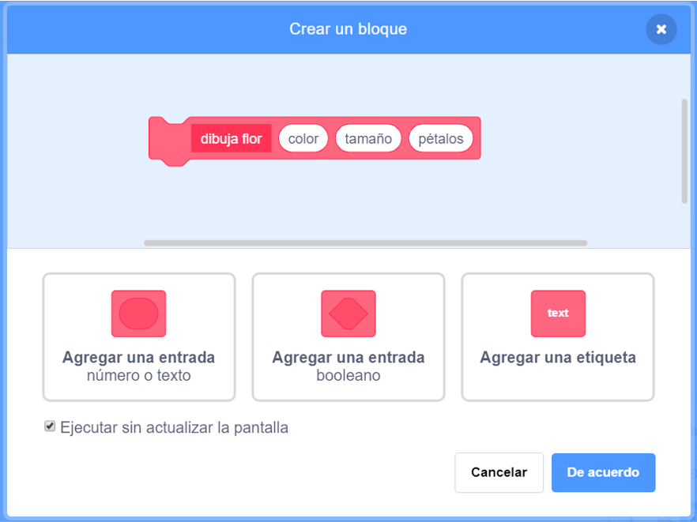
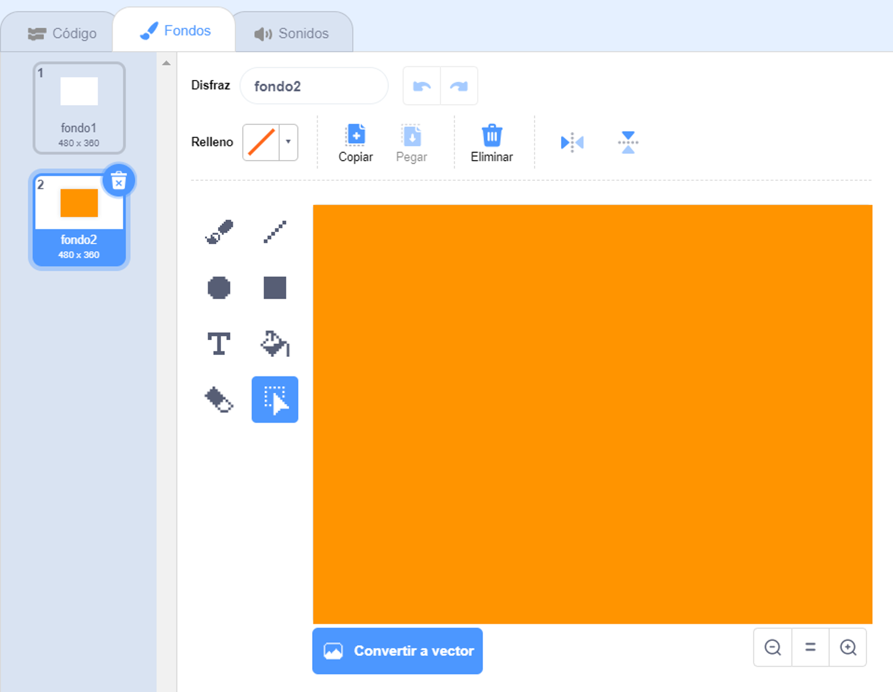

## Patrones de flores

También puedes usar tu bloque `dibujar flor`{:class="block3myblocks"} para crear patrones nítidos de flores.

\--- task \---

Crea una flor o una combinación de flores que te gusten. Aquí tienes un ejemplo:


```blocks3
when [p v] key pressed
erase all
go to x: (-150) y: (100)
draw flower (150) (80) (7) :: custom
draw flower (130) (35) (20) :: custom
```

\--- /task \---

\--- task \---

Presiona <kbd> p </kbd> para ver tu flor. El ejemplo se ve así:


\--- /task \---

Antes de que puedas crear tu modelo, debes limpiar el Escenario para que no queden flores sobrantes.

\--- task \---

Haz clic en el bloque `borrar todo` en la sección de bloques de Lapicero.

```blocks3
borrar todo
```

\--- /task \---

\--- task \---

Haz clic derecho en el objeto Flor y `selecciona ocultar`{:class="block3looks"} para que no aparezca en el Escenario. (Puedes `mostrar`{:class="block3looks"} el objeto de nuevo si necesitas ver dónde está.)

\--- /task \---

\--- task \---

Ahora dibuja una fila de estas flores a lo largo de la parte superior del Escenario. Aquí hay un código de ejemplo, en el que es posible que debas ajustar los números para que funcione con tu flor:


```blocks3
when [p v] key pressed
erase all
go to x: (-150) y: (100)
repeat (4) 
  draw flower (150) (80) (7) :: custom
  draw flower (130) (35) (20) :: custom
  change x by (100)
end
```

\--- /task \---

\--- task \---

Presiona `p` para ver una fila de flores:


\--- /task \---

\--- task \---

Agrega otro ciclo para crear más filas de flores. Este ejemplo agrega el ciclo ` repetir 3 ` {:class = "block3control"} para crear tres filas.


```blocks3
when [p v] key pressed
erase all
go to x: (-150) y: (100)
repeat (3) 
  repeat (4) 
    draw flower (150) (80) (7) :: custom
    draw flower (130) (35) (20) :: custom
    change x by (100)
  end
  set x to (-150)
  change y by (-100)
end
```

\--- /task \---

\--- task \---

Presiona <kbd>p</kbd> para crear una red de flores:


\--- /task \---

¿Quieres acelerar el dibujo de las flores?

\--- task \---

Haz un clic derecho en el bloque de definición `dibujar flor`{:class="block3myblocks"} y luego elige **editar**. Haga clic en la caja **Ejecutar sin actualizar la pantalla**.



Ahora las flores se dibujan más rápidamente.

\--- /task \---

También puedes cambiar el color del Escenario.

\--- task \---

Haz clic en **Elegir un fondo**, y luego haz clic en **Pintura**. Crea un fondo color naranja con la herramienta Relleno en modo Mapa de bits.



Si usas color naranja para el fondo y el objeto Flor, entonces los números para diferentes colores coincidirán para el objeto y el fondo.

\--- /task \---

\--- task \---

Ahora puedes usar el `efecto de color`{:class="block3looks"} en el Escenario para cambiar el color del fondo.


```blocks3
when [p v] key pressed
set [color v] effect to (30)
```

\--- /task \---

\--- task \---

Intenta crear un patrón que te guste.

Aquí tienes un ejemplo:


\--- /task \---

Cuando lo juntas todo, puedes crear un efecto sorprendente:

