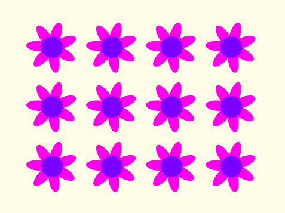

## Patrones de flores

También puedes usar tu bloque `dibujar flor`{:class="block3myblocks"} para crear patrones nítidos de flores.

\--- task \---

Crea una flor o una combinación de flores que te gusten. Aquí tienes un ejemplo:


```blocks3
when [p v] key pressed
erase all
go to x: (-150) y: (100)
draw flower (150) (80) (7) :: custom
draw flower (130) (35) (20) :: custom
```

\--- /task \---

\--- task \---

Presiona <kbd> p </kbd> para ver tu flor. El ejemplo se ve así:


\--- /task \---

Antes de que puedas crear tu modelo, debes limpiar el Escenario para que no queden flores sobrantes.

\--- task \---

Haz clic en el bloque `borrar todo` en la sección de bloques de Lapicero.

```blocks3
borrar todo
```

\--- /task \---

\--- task \---

Haz clic derecho en el objeto Flor y `selecciona ocultar`{:class="block3looks"} para que no aparezca en el Escenario. (Puedes `mostrar`{:class="block3looks"} el objeto de nuevo si necesitas ver dónde está.)

\--- /task \---

\--- task \---

Ahora dibuja una fila de estas flores a lo largo de la parte superior del Escenario. Aquí hay un código de ejemplo, en el que es posible que debas ajustar los números para que funcione con tu flor:


```blocks3
when [p v] key pressed
erase all
go to x: (-150) y: (100)
repeat (4) 
  draw flower (150) (80) (7) :: custom
  draw flower (130) (35) (20) :: custom
  change x by (100)
end
```

\--- /task \---

\--- task \---

Presiona `p` para ver una fila de flores:


\--- /task \---

\--- task \---

Agrega otro ciclo para crear más filas de flores. Este ejemplo agrega el ciclo ` repetir 3 ` {:class = "block3control"} para crear tres filas.


```blocks3
when [p v] key pressed
erase all
go to x: (-150) y: (100)
repeat (3) 
  repeat (4) 
    draw flower (150) (80) (7) :: custom
    draw flower (130) (35) (20) :: custom
    change x by (100)
  end
  set x to (-150)
  change y by (-100)
end
```

\--- /task \---

\--- task \---

Presiona <kbd>p</kbd> para crear una red de flores:



\--- /task \---

¿Quieres acelerar el dibujo de las flores?

\--- task \---

Right-click on the `draw flower`{:class="block3myblocks"} definition block and then click on **edit**. Click on the **Run without screen refresh** box.


Now the flowers get drawn more quickly.

\--- /task \---

You can also change the colour of the Stage.

\--- task \---

Click on **Choose a backdrop**, and then click on **Paint**. Create an orange backdrop by using the Fill tool in Bitmap mode.


If you use orange for the backdrop and the Flower sprite, then the numbers for different colours will match for the sprite and the backdrop.

\--- /task \---

\--- task \---

Now you can use the `set colour effect`{:class="block3looks"} on the Stage to change the colour of the backdrop.


```blocks3
when [p v] key pressed
set [color v] effect to (30)
```

\--- /task \---

\--- task \---

Try to create a pattern you like.

Here's an example:


\--- /task \---

When you put it all together, you can create an amazing effect:

