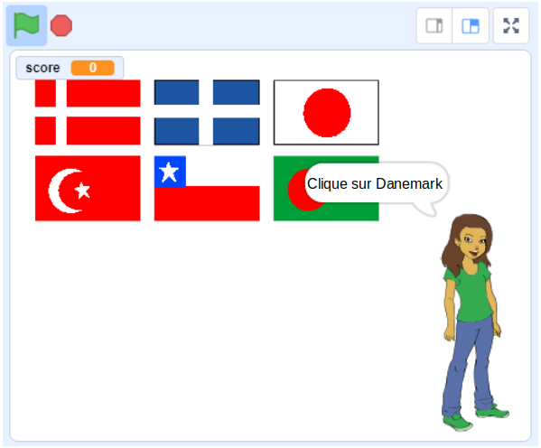

## Et ensuite?

Essaie notre projet [Devine le drapeau](https://projects.raspberrypi.org/fr-FR/projects/guess-the-flag?utm_source=pathway&utm_medium=whatnext&utm_campaign=projects), dans lequel tu peux créer un quiz pour deviner quel est le drapeau correspondant au nom du pays cité, à tester avec tes amis.

--- no-print ---

Clique sur le drapeau du pays qui t'est demandé.

  <iframe allowtransparency="true" width="485" height="402" src="https://scratch.mit.edu/projects/embed/276891625/?autostart=false" frameborder="0" scrolling="no"></iframe>

--- /no-print ---

--- print-only ---

--- /print-only ---

***
Ce projet a été traduit par des bénévoles:

Laurent Chastain

Jonathan Vannieuwkerke

Michel Arnols

Grâce aux bénévoles, nous pouvons donner aux gens du monde entier la chance d'apprendre dans leur propre langue. Vous pouvez nous aider à atteindre plus de personnes en vous portant volontaire pour la traduction - plus d'informations sur [rpf.io/translate](https://rpf.io/translate).