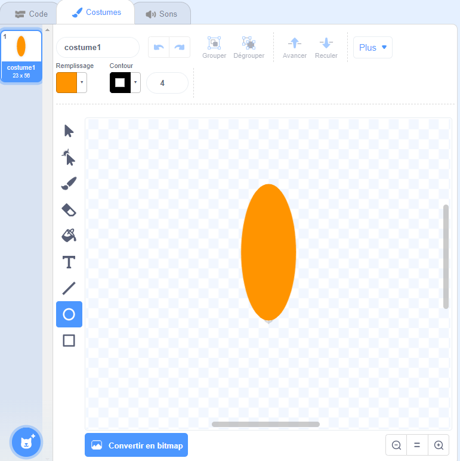
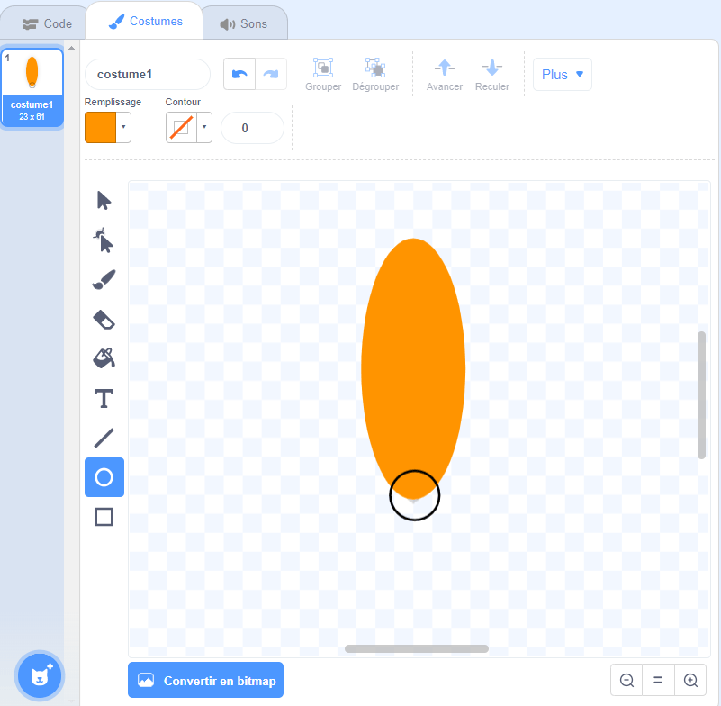

## Concevoir une fleur

Pour commencer tu vas créer une fleur qui sera dessinée sur la scène.

--- task ---

Crée un nouveau projet Scratch, et supprime le sprite de chat.

[[[generic-scratch3-new-project]]]

--- /task ---

--- task ---

Ajoute l'extension Stylo à ton projet.

[[[generic-scratch3-add-pen-extension]]]

--- /task ---

--- task ---

Utilise maintenant l'outil Peinture pour créer un nouveau sprite en forme de pétale de fleur.

Clique sur **Choisir un sprite** , puis clique sur **Peindre** et renomme le sprite «Fleur».

[[[generic-scratch3-draw-sprite]]]

--- /task ---

--- task ---

Utilise l'outil Cercle pour dessiner une forme de pétale remplie de couleur orange.



Plus tard, tu utiliseras du code pour ajouter plus de couleur.

--- /task ---

--- task ---

Ajoute le code suivant au sprite Fleur pour `estampiller`{:class="block3extensions"} une fleur avec six pétales tournés de manière égale `quand le drapeau vert est cliqué`{:class="block3control"}.


```blocks3
when green flag clicked
repeat (6) 
  stamp
  turn cw (60) degrees
end
```

--- /task ---

Tu peux constater que tes pétales sont disposés de manière étrange:


C'est dû au fait que le sprite tourne autour de son centre.

--- task ---

Déplace ton pétale de sorte que son fond soit au centre.



Cette opération est plus facile en effectuant un zoom arrière.

--- /task ---

Avant d'exécuter ton code à nouveau, tu dois utiliser le bloc `effacer tout`{:class="block3extensions"} pour effacer les sprites sur la scène.

--- task ---

Clique sur le bloc `effacer tout` dans la section des blocs Stylo.

```blocks3
erase all
```

--- /task ---

--- task ---

Exécute ton code à nouveau pour vérifier que les pétales de la fleur sont maintenant positionnés correctement.


Si ce n'est pas le cas, ajuste au mieux le bas du pétale en tant que centre de ce sprite.

--- /task ---