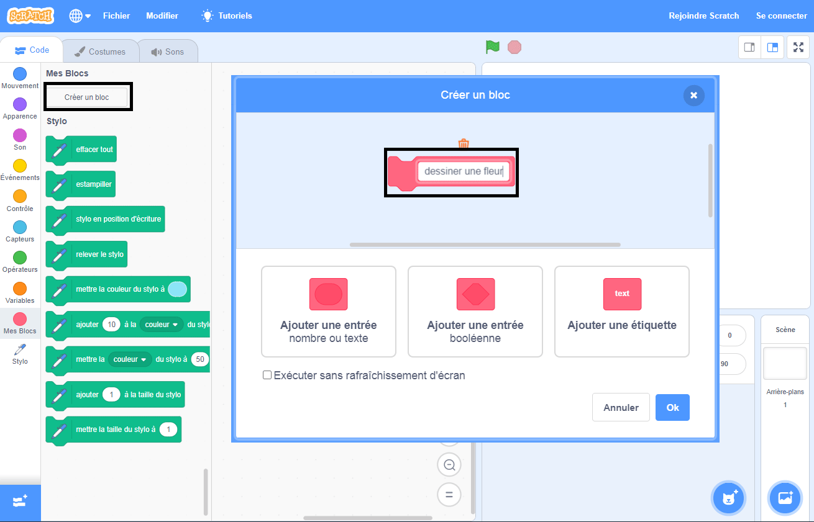

## Créer un bloc personnalisé pour dessiner des fleurs

Comment faire si tu veux dessiner beaucoup de fleurs ? Au lieu de faire de nombreuses copies du code, tu vas créer ton propre bloc dans Scratch et l'utiliser à chaque fois que tu voudras dessiner une fleur.

\--- task \---

Cliques sur **Mes blocs** puis sur **Créer un bloc** pour créer ton propre bloc appelé « dessiner une fleur ».



\--- /task \---

\--- task \---

Il y a maintenant un nouveau bloc appelé `dessiner une fleur`{:class="block3myblocks"} dans la section **Plus de blocs** et un nouveau bloc de définition sur la scène.

```blocks3
draw flower :: custom

define draw flower
```

\--- /task \---

\--- task \---

Déplace ton code pour dessiner la fleur depuis le bloc `quand le drapeau vert est cliqué`{:class="block3events"} vers le nouveau bloc de définition `dessiner la fleur`{:class="block3myblocks"}.

Ton code devrait ressembler à ceci :


```blocks3
define draw flower
repeat (6) 
  stamp
  turn cw (60) degrees
end

when green flag clicked
```

\--- /task \---

\--- task \---

Ajoute le code suivant pour vider la scène et utilise ton nouveau bloc `dessiner une fleur`{:class="block3myblocks"} quand le drapeau vert est cliqué :


```blocks3
when green flag clicked
erase all
draw flower :: custom
```

\--- /task \---

\--- task \---

Clique sur le drapeau vert pour tester ton code et vérifie si tu vois une fleur.

\--- /task \---

\--- task \---

Maintenant, change ton code pour déplacer le sprite puis dessine une autre fleur :


```blocks3
when green flag clicked
erase all
go to x: (75) y: (75)
draw flower :: custom
go to x: (-75) y: (-75)
draw flower :: custom 
```

\--- /task \---

\--- task \---

Teste ton code pour vérifier que tu vois maintenant deux fleurs.


\--- /task \---