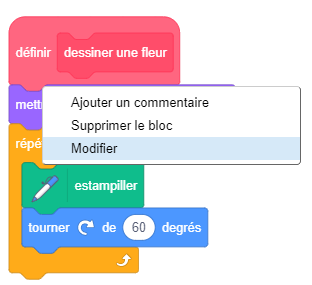
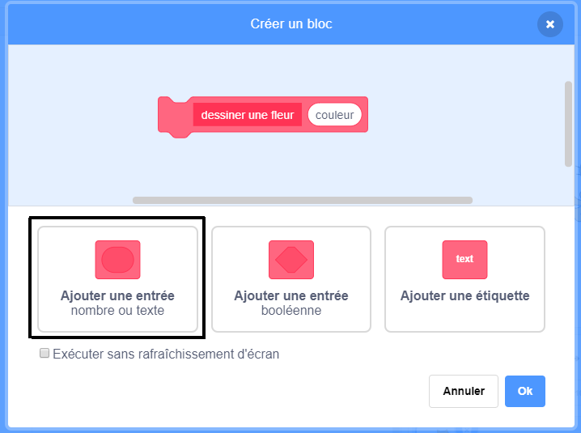
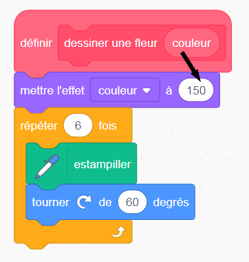

## Personnalise tes fleurs

Pour le moment toutes les fleurs que tu dessines sont exactement les mêmes. Ensuite tu vas ajouter quelques entrées au bloc `dessiner la fleur`{:class="block3myblocks"} pour que tu puisses dessiner des fleurs avec des couleurs , tailles et nombres de pétales différents.

\--- task \---

Dans Scratch, tu peux utiliser le bloc `mettre l'effet couleur à`{:class="block3looks"} pour changer la couleur d'un sprite.

Modifie la définition de « dessiner une fleur » pour changer la couleur :


```blocks3
define draw flower
set [color v] effect to (150)
repeat (6) 
  stamp
  turn cw (60) degrees
end
```

\--- /task \---

\--- task \---

Exécute ton code et observe que les fleurs ont changé de couleurs.


`mettre l'effet couleur à`{:class="block3looks"} change la couleur basée sur la couleur par défaut du sprite, donc si ton sprite ne démarre pas orange, tu obtiens des résultats différents.

\--- /task \---

\--- task \---

Expérimente avec l'utilisation de nombres différents du bloc `0` à `199` dans le bloc `mettre l'effet couleur à`{:class="block3looks"}, et observe quels sont les différents résultats que tu obtiens.

\--- /task \---

Pour l'instant toutes les fleurs sont de la même couleur. Pour donner à chaque fleur une couleur différente, tu dois ajouter un bloc **entrée** au bloc `dessiner la fleur`{:class="block3myblocks"}.

\--- task \---

Fais un clic droit sur le bloc de définition `dessiner la fleur`{:class="block3myblocks"} et choisis **modifier**:



\--- /task \---

\--- task \---

Ajoute une **entrée de type nombre** appelée « couleur » :



Cette entrée apparaît dans la définition `dessiner la fleur`{:class="block3myblocks"}, et tu peux la glisser là où tu veux l'utiliser.

\--- /task \---

\--- task \---

Fais glisser l'entrée « couleur » vers le bloc `définir l'effet de couleur`{:class="block3looks"} :



Ton code devrait ressembler à ceci :


```blocks3
define draw flower (colour)
set [color v] effect to (colour :: custom-arg)
repeat (6)
  stamp
  turn cw (60) degrees
end
```

\--- /task \---

Remarque que tes blocs `dessiner une fleur`{:class="block3myblocks"} ont maintenant une nouvelle entrée qui est définie sur `1`:

```blocks3
when green flag clicked
erase all
go to x: (75) y: (75)
draw flower (1) :: custom
go to x: (-75) y: (-75)
draw flower (1) :: custom
```

\--- task \---

Change les nombres dans les blocs `dessiner une fleur`{:class="block3myblocks"} pour que les deux fleurs apparaissent dans des couleurs différentes. Tu peux choisir n'importe quel nombre entre 0 et 200.

Ton code devrait ressembler à ceci :


```blocks3
when green flag clicked
erase all
go to x: (75) y: (75)
draw flower (180) :: custom
go to x: (-75) y: (-75)
draw flower (150) :: custom
```

\--- /task \---

\--- task \---

Maintenant, ajoute une autre entrée pour définir la taille de la fleur, de sorte que ton bloc `dessiner une fleur`{:class="block3myblocks"} ressemble à ceci :


```blocks3
draw flower (180) (150) :: custom
```

Avec le bloc ci-dessus, tu peux créer des fleurs de différentes tailles :


\--- astuces \---

\--- hint \---

Regarde ce que tu as fait pour ajouter l'entrée `couleur`, et répète-le pour ajouter une entrée « taille » que tu peux utiliser pour définir la taille du sprite Fleur.

\--- /indice \---

\--- hint \---

Modifie le bloc `Dessiner la fleur`{:class="block3myblocks"} pour ajouter une nouvelle entrée appelée « taille ».

Tu dois ajouter le bloc suivant avec une entrée « taille » au bloc de définition `dessiner la fleur`{:class="block3myblocks"} :

```blocks3
set size to (100) %
```

\--- /indice \---

\--- hint \---

Fais un clic droit sur le bloc de définition `dessiner une fleur`{:class="block3myblocks"}, clique sur **modifier**, et ajoute un nombre appelé « taille ».


Change ton script `définit dessiner une fleur`{:class="block3myblocks"} pour qu'il ressemble à ceci :

```blocks3
define draw flower (colour) (size :: custom-arg)
set [color v] effect to (colour :: custom-arg)
set size to (size :: custom-arg) %
repeat (6) 
  stamp
  turn cw (60) degrees
end
```

\--- /indice \---

\--- /astuces \---

\--- /task \--- \--- task \---

Dans le script `quand le drapeau vert est cliqué`{:class="block3events"}, change le deuxième nombre dans les deux blocs `dessiner une fleur`{:class="block3myblocks"} pour que les deux fleurs apparaissent en différentes tailles.

```blocks3
when green flag clicked
erase all
go to x: (75) y: (75)
draw flower (180) (150) :: custom
go to x: (-75) y: (-75)
draw flower (150) (50) :: custom
```

\--- /task \---

\--- task \---

Teste ton code pour vérifier si les fleurs ont des tailles différentes.

\--- /task \---

\--- task \---

Ce serait cool de choisir le nombre de pétales des fleurs.

Ajoute une autre entrée pour que tu puisses dessiner des fleurs comme ceci :


\--- hints \--- \--- hint \---

Tu dois ajouter une entrée « pétales », puis l'utiliser dans le bloc `définir dessiner une fleur`{:class="block3myblocks"}.

Il y a deux endroits où tu dois ajouter l'entrée « pétales ».

Le nombre de degrés que le sprite Fleur devrait `tourner`{:class="block3looks"} est `360` divisé par le nombre de pétales.

\--- /hint \---

\--- hint \---

Change ton `définir dessiner une fleur`{:class="block3myblocks"} pour ressembler à ceci :


```blocks3
define draw flower (colour) (size :: custom-arg) (petals)
```

Mets à jour tes blocs `répéter`{:class="block3control"} et `tourner`{:class="block3looks"} de sorte qu'ils utilisent l'entrée « pétales ».

```blocks3
repeat (petals :: custom-arg) 
end

turn cw ((360) / (petals :: custom-arg)) degrees
```

Mets à jour tes blocs `dessiner une fleur`{:class="block3myblocks"} pour utiliser l'entrée « pétales ».

```blocks3
draw flower (150) (50) (8) :: custom
```

\--- /hint \---

\--- hint \---

Modifie ton bloc `définir dessiner une fleur`{:class="block3myblocks"} et ajoute une nouvelle entrée de numéro appelée « pétales ».


Ton code devrait ressembler à ceci :

```blocks3
define draw flower (colour) (size :: custom-arg) (petals)
set [color v] effect to (colour :: custom-arg)
set size to (size :: custom-arg) %
repeat (petals :: custom-arg) 
  stamp
  turn cw ((360) / (petals :: custom-arg)) degrees
end

```

Dans le script `quand le drapeau vert est cliqué`{:class="block3events"}, change le troisième nombre dans les deux blocs `dessiner une fleur`{:class="block3myblocks"} pour que les deux fleurs qui apparaissent aient un nombre différent de pétales.

```blocks3
when green flag clicked
erase all
go to x: (75) y: (75)
draw flower (180) (150) (3) :: custom
go to x: (-75) y: (-75)
draw flower (150) (50) (8) :: custom
```

\--- /hint \---

\--- /hints \---

\--- /task \---

Ensuite, modifie ton code pour pouvoir dessiner des fleurs différentes en appuyant sur la touche <kbd>f</kbd>.

\--- task \---

Maintenant, déplace ton code pour dessiner des fleurs en dessous du bloc `quand le drapeau vert est cliqué`{:class="block3events"}, et mets le code sous un bloc `quand la touche f est pressée`{:class="block3events"}.


```blocks3
when green flag clicked
```

```blocks3
when [f v] key pressed
erase all
go to x: (75) y: (75)
draw flower (180) (150) (3) :: custom
go to x: (-75) y: (-75)
draw flower (150) (50) (8) :: custom
```

\--- /task \---

\--- task \---

Appuie sur <kbd>f</kbd> pour tester ton code.

\--- /task \---

\--- task \---

Ajoute plus de blocs `dessiner une fleur`{:class="block3myblocks"} à ton programme pour dessiner des fleurs avec des couleurs, tailles et nombres de pétales différents sur toute la scène.

\--- /task \---