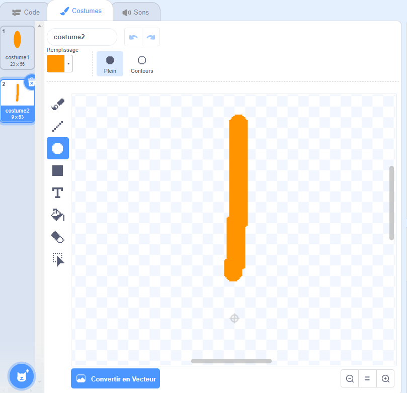

## Défi: créer un design floral

Peux-tu utiliser ton bloc `dessiner une fleur`{:class="block3myblocks"} plusieurs fois pour dessiner plus de fleurs et créer un design intéressant ? Dessiner des fleurs différentes au même endroit crée un effet intéressant.

Crée un design que tu aimes. Voici un exemple:

Tu n'as pas à utiliser des pétales façonnés comme des ellipses. Par exemple, tu peux utiliser des lignes droites épaisses et un arrière-plan noir pour créer un motif de feux d'artifice comme ceci:

Le «pétale» pour le motif du feu d'artifice n'est qu'une ligne:

Ajoute de nouveaux costumes de pétales et vois quelles fleurs tu peux créer.

Essaie une forme de sprite qui n'est pas remplie, comme un carré, et regarde ce qui se passe

