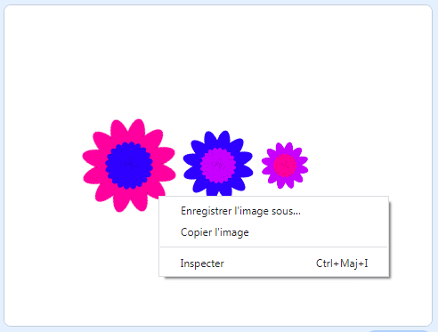

## Enregistre tes images

Lorsque tu crées une image que tu aimes, tu peux l’enregistrer et l’utiliser dans un autre projet Scratch, comme un économiseur d’écran ou sur un site Web.

\--- task \---

Quand il y a une image sur la scène que tu aimes, fais un clic droit dessus puis clique sur **enregistrer l'image sous**

**Remarque :** sur certains ordinateurs ou navigateurs, l'option de menu pour enregistrer ton image peut être nommée différemment.

Ensuite, tu peux enregistrer une image PNG de la scène.

\--- /task \---